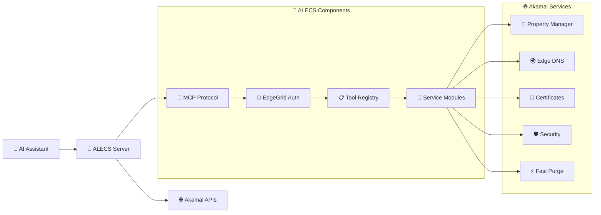

# 🚀 ALECS MCP Server for Akamai

<div align="center">


**A Launchgrid for Edge & Cloud Services**

_AI-powered Akamai CDN management through natural language_

<br>

[](https://www.npmjs.com/package/alecs-mcp-server-akamai)
[](https://github.com/acedergren/alecs-mcp-server-akamai/releases)
[](https://github.com/acedergren/alecs-mcp-server-akamai/actions)
[](cursor://anysphere.cursor-deeplink/mcp/install?name=alecs-akamai&config=eyJhbGVjcy1ha2FtYWkiOnsiY29tbWFuZCI6ImFsZWNzIiwiYXJncyI6W10sImVudiI6eyJNQ1BfVFJBTlNQT1JUIjoic3RkaW8ifX19)

<br>

**🔧 156 Tools** • **🌐 15 Services** • **🔐 Full EdgeRC Support** • **⚡ Production Ready**

<br>

</div>

## 🎯 What is ALECS?

ALECS bridges the gap between **AI tools** and **Akamai's Connected Cloud Platform**. Ask Claude,
Cursor, or any MCP-compatible tool to manage your Akamai infrastructure using natural language and
minimize context switching when creating Infrastructure-as-Code!

<div align="center">

```
"List my Akamai properties"          →  Complete property inventory
"Create a DNS zone for example.com"  →  Zone created and configured
"Purge cache for /images/*"          →  Cache invalidated instantly
"Check SSL certificate status"       →  Validation progress shown
```

</div>

## 🎉 One-Click Installation

<div align="center">

<table>
<tr>
<td align="center" width="20%">

<br><strong>Claude Desktop</strong>
<br>
<details>
<summary>📱 Install</summary>

**macOS:**

```bash
curl -sSL https://raw.githubusercontent.com/acedergren/alecs-mcp-server-akamai/main/scripts/install-claude-desktop.sh | bash
```

**Windows:**

```powershell
# Download and run installation script
Invoke-WebRequest -Uri "https://raw.githubusercontent.com/acedergren/alecs-mcp-server-akamai/main/scripts/install-claude-desktop.sh" -OutFile "install-claude-desktop.sh"
bash install-claude-desktop.sh
```

**Linux:**

```bash
curl -sSL https://raw.githubusercontent.com/acedergren/alecs-mcp-server-akamai/main/scripts/install-claude-desktop.sh | bash
```

</details>
</td>
<td align="center" width="20%">

<br><strong>Cursor</strong>
<br>
<details>
<summary>🎯 Install</summary>

**One-click button:**
[](cursor://anysphere.cursor-deeplink/mcp/install?name=alecs-akamai&config=eyJhbGVjcy1ha2FtYWkiOnsiY29tbWFuZCI6ImFsZWNzIiwiYXJncyI6W10sImVudiI6eyJNQ1BfVFJBTlNQT1JUIjoic3RkaW8ifX19)

**Auto-install script:**

```bash
curl -sSL https://raw.githubusercontent.com/acedergren/alecs-mcp-server-akamai/main/scripts/install-cursor.sh | bash
```

</details>
</td>
<td align="center" width="20%">

<br><strong>LM Studio</strong>
<br>
<details>
<summary>🎬 Install</summary>

**One-click button:**
[](lmstudio://mcp/install?name=alecs-akamai&config=eyJhbGVjcy1ha2FtYWkiOnsiY29tbWFuZCI6ImFsZWNzIiwiYXJncyI6W10sImVudiI6eyJNQ1BfVFJBTlNQT1JUIjoic3RkaW8ifX19)

**Auto-install script:**

```bash
curl -sSL https://raw.githubusercontent.com/acedergren/alecs-mcp-server-akamai/main/scripts/install-lmstudio.sh | bash
```

</details>
</td>
<td align="center" width="20%">

<br><strong>VS Code</strong>
<br>
<details>
<summary>💻 Install</summary>

**Extension + Server:**

```bash
curl -sSL https://raw.githubusercontent.com/acedergren/alecs-mcp-server-akamai/main/scripts/install-vscode.sh | bash
```

**Manual Setup:**

1. Install MCP extension
2. `Cmd/Ctrl + Shift + P`
3. "MCP: Add Server"
4. Command: `alecs`
</details>
</td>
<td align="center" width="20%">

<br><strong>Windsurf</strong>
<br>
<details>
<summary>🌊 Install</summary>

**Auto-configure:**

```bash
curl -sSL https://raw.githubusercontent.com/acedergren/alecs-mcp-server-akamai/main/scripts/install-windsurf.sh | bash
```

**Manual Setup:**

1. Open Windsurf Settings
2. Navigate to MCP Servers
3. Add server with command: `alecs`
</details>
</td>
</tr>
<tr>
<td align="center" width="20%">

<br><strong>Claude Code</strong>
<br>
<details>
<summary>⚡ Install</summary>

**Simple command:**

```bash
claude mcp add alecs-akamai alecs
```

**Verify:**

```bash
claude mcp list
```

</details>
</td>
<td colspan="4" align="center">
<br><strong>More AI Tools Coming Soon...</strong>
</td>
</tr>
</table>

</div>

## 📦 Quick Start

### 1. Install ALECS

Choose your preferred method:

<div align="center">

<table>
<tr>
<td align="center" width="33%">

<br><strong>NPM</strong>
<br>
<details>
<summary>📦 Install</summary>

**Global install:**

```bash
npm install -g alecs-mcp-server-akamai
```

**Verify:**

```bash
alecs --version
```

</details>
</td>
<td align="center" width="33%">

<br><strong>Homebrew</strong>
<br>
<details>
<summary>🍺 Install</summary>

**macOS/Linux:**

```bash
curl -sSL https://raw.githubusercontent.com/acedergren/alecs-mcp-server-akamai/main/scripts/install-homebrew.sh | bash
```

**Manual:**

```bash
brew install node
npm install -g alecs-mcp-server-akamai
```

</details>
</td>
<td align="center" width="33%">

<br><strong>Docker</strong>
<br>
<details>
<summary>🐳 Install</summary>

**Quick start:**

```bash
docker run -it --env-file .env ghcr.io/acedergren/alecs-mcp-server-akamai:latest
```

**See full Docker section below for more options**

</details>
</td>
</tr>
</table>

</div>

### 2. Configure Akamai

Create `~/.edgerc` with your credentials:

```ini
[default]
client_secret = your_client_secret
host = your_host.luna.akamaiapis.net
access_token = your_access_token
client_token = your_client_token
```

### 3. Choose Your AI Tool

Pick your favorite AI assistant and use the one-click installers above! 🚀

## 🌟 Features

<div align="center">

<table>
<tr>
<td align="center" width="25%">

<br><strong>🔧 156 Tools</strong>
<br>Complete Akamai API coverage
</td>
<td align="center" width="25%">

<br><strong>🏢 Multi-Customer</strong>
<br>Manage multiple accounts
</td>
<td align="center" width="25%">

<br><strong>🔒 Secure</strong>
<br>EdgeGrid authentication
</td>
<td align="center" width="25%">

<br><strong>🤖 AI-Native</strong>
<br>Natural language control
</td>
</tr>
</table>

</div>

## 🛠️ Service Coverage

<div align="center">

| Service                 | Tools | Key Features                    |
| ----------------------- | ----- | ------------------------------- |
| **🏢 Property Manager** | 25    | CDN configs, rules, activations |
| **🛡️ Security**         | 47    | Network lists, WAF policies     |
| **🌐 Edge DNS**         | 12    | DNS zones, records, DNSSEC      |
| **📋 Includes**         | 10    | Include configurations          |
| **🔗 Edge Hostnames**   | 10    | Hostname management             |
| **📊 Reporting**        | 9     | Analytics and metrics           |
| **🔐 Certificates**     | 8     | SSL/TLS lifecycle management    |
| **⚡ Fast Purge**       | 8     | Cache invalidation              |
| **🔧 Workflow**         | 7     | Orchestration and automation    |
| **🌐 Hostname Mgmt**    | 5     | Advanced hostname operations    |
| **📦 Bulk Operations**  | 5     | Batch processing                |
| **🚨 SIEM**             | 4     | Security monitoring             |
| **🏗️ Rule Tree**        | 4     | Rule processing                 |
| **📊 CPCode**           | 2     | Traffic analysis codes          |

</div>

## 🎨 Natural Language Examples

<div align="center">

<table>
<tr>
<td width="50%">

**🗣️ What You Say**

```
"List my properties"
"Create DNS zone for example.com"
"Purge cache for /images/*"
"Check my SSL certificates"
"Show traffic for last 7 days"
"Add IP 192.168.1.0/24 to blocklist"
```

</td>
<td width="50%">

**🤖 What ALECS Does**

```
✅ property_list → Full inventory
✅ dns_zone_create → Zone configured
✅ fastpurge_url → Cache cleared
✅ certificate_status → SSL validated
✅ traffic_report → Analytics shown
✅ network_list_add → IP blocked
```

</td>
</tr>
</table>

</div>

## 🏗️ Architecture

<div align="center">



</div>

## 🐳 Docker & Deployment

### Quick Start

```bash
# Standard I/O for Claude Desktop (default)
docker run -it --env-file .env ghcr.io/acedergren/alecs-mcp-server-akamai:latest

# Streamable HTTP for web/CDN deployment
docker run -it -p 8080:8080 -e MCP_TRANSPORT=streamable-http --env-file .env ghcr.io/acedergren/alecs-mcp-server-akamai:latest
```

### Transport Options

```bash
# Available transports
MCP_TRANSPORT=stdio           # Default - Claude Desktop, Cursor, CLI tools
MCP_TRANSPORT=streamable-http # Web clients, CDN deployment (recommended)
MCP_TRANSPORT=websocket       # Real-time bidirectional communication
MCP_TRANSPORT=sse             # Legacy Server-Sent Events (deprecated)

# Transport-specific configuration
HTTP_PORT=8080                # Port for streamable HTTP (default: 8080)
HTTP_HOST=0.0.0.0            # Host for streamable HTTP
HTTP_PATH=/mcp               # Base path for HTTP endpoints
CORS_ENABLED=true            # Enable CORS for browser clients
```

### Available Docker Images

```bash
docker pull ghcr.io/acedergren/alecs-mcp-server-akamai:latest    # Full server
docker pull ghcr.io/acedergren/alecs-mcp-server-akamai:modular   # Microservices
docker pull ghcr.io/acedergren/alecs-mcp-server-akamai:websocket # WebSocket
docker pull ghcr.io/acedergren/alecs-mcp-server-akamai:http      # Streamable HTTP
```

## 📚 Documentation

<div align="center">

| 📖 Guide                                                | 📝 Description              |
| ------------------------------------------------------- | --------------------------- |
| **[API Reference](./docs/api/README.md)**               | Complete tool documentation |
| **[Getting Started](./docs/getting-started/README.md)** | Setup tutorials             |
| **[Transport Guide](./docs/TRANSPORT_GUIDE.md)**        | Network transports & CDN    |
| **[Architecture](./docs/architecture/README.md)**       | System design               |
| **[Tool Creation](./docs/TOOL_CREATION_GUIDE.md)**      | Build custom tools          |
| **[Troubleshooting](./docs/troubleshooting/README.md)** | Common issues               |

</div>

## 🤝 Contributing

We welcome contributions! Check out our [Contributing Guide](./CONTRIBUTING.md) to get started.

<div align="center">

**🐛 Found a bug?** [Report it](https://github.com/acedergren/alecs-mcp-server-akamai/issues) **💡
Have an idea?** [Suggest it](https://github.com/acedergren/alecs-mcp-server-akamai/issues/new) **❓
Need help?** [Ask us](https://github.com/acedergren/alecs-mcp-server-akamai/discussions)

</div>

## 📄 License

GNU Affero General Public License v3.0 (AGPL-3.0) - see [LICENSE](./LICENSE)

---

<div align="center">

**🌟 Star us on GitHub** • **📦 Follow on NPM** • **🐳 Use with Docker**

Built with ❤️ for Akamai by Alexander Cedergren, alex@solutionsedge.io

</div>
