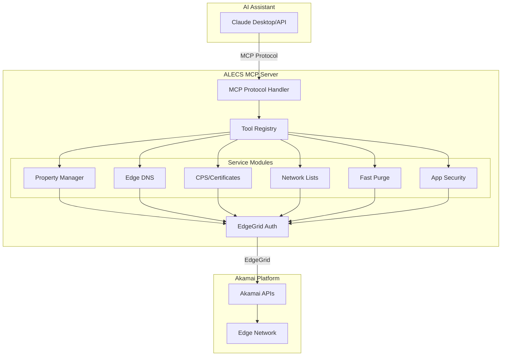

# ALECS MCP Server for Akamai

> **A**kamai **L**ocal **E**dge **C**onfiguration **S**erver - A Model Context Protocol (MCP) server that enables AI assistants to manage Akamai CDN configurations.

## 🚀 Quick Start

```bash
# Clone and install
git clone https://github.com/your-org/alecs-mcp-server-akamai.git
cd alecs-mcp-server-akamai
./install.sh

# Configure Akamai credentials
cp .edgerc.example ~/.edgerc
# Edit ~/.edgerc with your Akamai API credentials
```

## 📋 Overview

ALECS bridges AI assistants (like Claude) with Akamai's powerful CDN platform through the Model Context Protocol. It provides a type-safe, production-ready interface for managing properties, DNS zones, certificates, and more.

### Key Features

- **🏢 Multi-Customer Support** - Manage multiple Akamai accounts via `.edgerc` sections
- **🔐 Secure Authentication** - EdgeGrid authentication with account switching
- **📦 Comprehensive Coverage** - Property Manager, Edge DNS, CPS, Network Lists, Fast Purge
- **🤖 AI-Optimized** - Designed for conversational interactions with helpful error messages
- **📊 Production Ready** - Type-safe, well-tested, with structured logging

## 🏗️ Architecture



## 🛠️ Available Tools

### Property Management
- `property.list` - List CDN properties
- `property.create` - Create new property
- `property.activate` - Deploy to staging/production
- `property.rules.get` - Get configuration rules
- `property.rules.update` - Modify behaviors

### DNS Management  
- `dns.zone.list` - List DNS zones
- `dns.zone.create` - Create zones
- `dns.record.create` - Add DNS records
- `dns.record.update` - Modify records
- `dns.zone.activate` - Activate changes

### Certificate Management
- `certs.dv.create` - Create DV certificates
- `certs.enrollment.status` - Check validation
- `certs.challenges.get` - Get validation records

### Content Control
- `fastpurge.url` - Purge by URL
- `fastpurge.cpcode` - Purge by CP code
- `network-lists.create` - Create IP/geo lists
- `network-lists.update` - Modify access lists

## 🔧 Installation

### For Claude Desktop

1. Install ALECS:
```bash
./install.sh
# Choose option 4 for Claude Desktop
```

2. The installer creates a config file. Copy it to Claude:
```bash
cp claude_desktop_config.json ~/Library/Application\ Support/Claude/
```

3. Restart Claude Desktop

### For Development

```bash
# Install dependencies
npm install

# Build TypeScript
npm run build

# Run in stdio mode (for testing)
npm run dev
```

## 📚 Documentation

- [Architecture Overview](./docs/architecture/README.md) - System design and components
- [Getting Started Guide](./docs/getting-started/README.md) - Quick tutorials
- [API Reference](./docs/api/README.md) - Detailed tool documentation
- [User Guides](./docs/user-guides/README.md) - How-to guides and examples

## 🧪 Testing

```bash
# Run all tests
npm test

# Run specific test suite
npm test -- property-tools

# Type checking
npm run typecheck
```

## 🔒 Security

- Credentials stored in `~/.edgerc` (never in code)
- EdgeGrid authentication for all API calls
- Account switching via secure headers
- No OAuth required - simplified security model

## 🤝 Contributing

1. Fork the repository
2. Create a feature branch
3. Make your changes with tests
4. Run `npm test` and `npm run typecheck`
5. Submit a pull request

## 📄 License

MIT License - see [LICENSE](./LICENSE) file

## 🆘 Support

- [GitHub Issues](https://github.com/your-org/alecs-mcp-server-akamai/issues)
- [Akamai Developer Docs](https://techdocs.akamai.com)
- [MCP Specification](https://modelcontextprotocol.io)

---

Built with ❤️ for the Akamai and AI communities