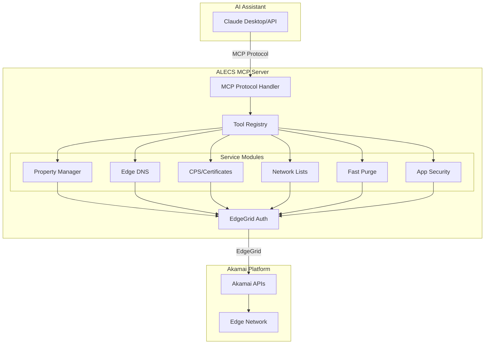

<div align="center">

# 🚀 ALECS MCP Server for Akamai

[](https://www.npmjs.com/package/alecs-mcp-server-akamai)
[](https://www.npmjs.com/package/alecs-mcp-server-akamai)
[](https://github.com/acedergren/alecs-mcp-server-akamai/pkgs/container/alecs-mcp-server-akamai)
[](https://github.com/acedergren/alecs-mcp-server-akamai/releases)

[](https://github.com/acedergren/alecs-mcp-server-akamai/actions)
[](https://github.com/acedergren/alecs-mcp-server-akamai/actions)
[](https://github.com/acedergren/alecs-mcp-server-akamai)

[](https://www.typescriptlang.org/)
[](https://nodejs.org/)
[](https://modelcontextprotocol.io/)

[](https://www.gnu.org/licenses/agpl-3.0)
[](http://makeapullrequest.com)

</div>

<div align="center">
  <p align="center">
    <strong>A</strong> <strong>L</strong>aunchgrid for <strong>E</strong>dge & <strong>C</strong>loud <strong>S</strong>ervices
  </p>
  <p align="center">
    <i>A Model Context Protocol (MCP) server that brings AI-powered automation to Akamai CDN management</i>
  </p>
  
  <p align="center">
    <strong>Compatible with:</strong>
    <a href="https://claude.ai">Claude Desktop</a> •
    <a href="https://claude.ai/code">Claude Code</a> •
    <a href="https://cursor.com">Cursor</a> •
    <a href="https://www.windsurf.ai">Windsurf</a> •
    <a href="https://code.visualstudio.com">VS Code</a> •
    <a href="https://github.com/modelcontextprotocol/servers">Any MCP Client</a>
  </p>
  
  <p align="center">
    <a href="#-quick-start">Quick Start</a> •
    <a href="#-features">Features</a> •
    <a href="https://docs.alecs.io">Documentation</a> •
    <a href="#-contributing">Contributing</a>
  </p>
</div>

<div align="center">
  
### 📊 Latest Release Docs


[](https://deepwiki.com/acedergren/alecs-mcp-server-akamai)

</div>

---

## 🚀 Quick Start

### Install from NPM

```bash
# Install globally
npm install -g alecs-mcp-server-akamai

# Verify installation
alecs --version

# Run the main server (all 198+ tools)
alecs

# Or run specific service modules
alecs start:property  # Property management only
alecs start:dns       # DNS management only
alecs start:certs     # Certificate management only
# See all variants: alecs --help
```

📖 **[Full NPM Variants Guide](./docs/npm-variants-guide.md)** - Learn about all server variants and configurations

### Configure Akamai Credentials

Create `~/.edgerc` with your Akamai API credentials:

```ini
[default]
client_secret = your_client_secret
host = your_host.luna.akamaiapis.net
access_token = your_access_token
client_token = your_client_token

; Optional: Add more customer sections
[customer-name]
client_secret = customer_client_secret
host = customer_host.luna.akamaiapis.net
access_token = customer_access_token
client_token = customer_client_token
```

### Configure SecureMobi (Optional)

If you want to use SecureMobi tools, add your SecureMobi credentials to environment variables:

```bash
# Add to your shell profile (.bashrc, .zshrc, etc.) or .env file
export SECUREMOBI_CLIENT_ID="your_securemobi_client_id"
export SECUREMOBI_CLIENT_SECRET="your_securemobi_client_secret"
```

Or configure in Claude Desktop (see next section).

**SecureMobi Tools Available:**
- `securemobi-list-zones` - List DNS zones
- `securemobi-list-tenants` - List tenants
- `securemobi-create-tenant` - Create new tenant
- `securemobi-get-tenant` - Get tenant details
- `securemobi-update-tenant` - Update tenant
- `securemobi-delete-tenant` - Delete tenant

### Add to Claude Desktop

**Basic Configuration (Akamai only):**
```bash
# macOS
echo '{"mcpServers":{"alecs-akamai":{"command":"alecs","args":[],"env":{"MCP_TRANSPORT":"stdio"}}}}' > ~/Library/Application\ Support/Claude/claude_desktop_config.json

# Windows
echo {"mcpServers":{"alecs-akamai":{"command":"alecs","args":[],"env":{"MCP_TRANSPORT":"stdio"}}}} > %APPDATA%\Claude\claude_desktop_config.json

# Linux
echo '{"mcpServers":{"alecs-akamai":{"command":"alecs","args":[],"env":{"MCP_TRANSPORT":"stdio"}}}}' > ~/.config/Claude/claude_desktop_config.json
```

**With SecureMobi Support:**
```json
{
  "mcpServers": {
    "alecs-akamai": {
      "command": "alecs",
      "args": [],
      "env": {
        "MCP_TRANSPORT": "stdio",
        "SECUREMOBI_CLIENT_ID": "your_securemobi_client_id_here",
        "SECUREMOBI_CLIENT_SECRET": "your_securemobi_client_secret_here"
      }
    }
  }
}
```

Copy this configuration to your Claude Desktop config file:
- **macOS**: `~/Library/Application Support/Claude/claude_desktop_config.json`
- **Windows**: `%APPDATA%\Claude\claude_desktop_config.json`  
- **Linux**: `~/.config/Claude/claude_desktop_config.json`

### Add to Claude Code

```bash
# One-line installation
claude mcp add alecs-akamai alecs
```

### Install from Source

```bash
# Clone and install
git clone https://github.com/acedergren/alecs-mcp-server-akamai.git
cd alecs-mcp-server-akamai
npm install

# Build
npm run build
```

### Docker

```bash
# Pull from Docker Hub (recommended)
docker pull acedergr/alecs-mcp-server-akamai:latest

# Or pull from GitHub Container Registry
docker pull ghcr.io/acedergren/alecs-mcp-server-akamai:latest

# Run with environment variables
docker run -it --env-file .env acedergr/alecs-mcp-server-akamai:latest
```

#### Available Docker Tags

| Tag | Description | Size |
|-----|-------------|------|
| `latest` | Main server with PM2 management | ~200MB |
| `modular` | Microservices architecture | ~180MB |
| `websocket` | WebSocket transport | ~170MB |
| `sse` | Server-Sent Events transport | ~170MB |

## 📖 Integration Guide

### Quick Reference

| Tool | Installation Command |
|------|---------------------|
| **Claude Desktop** | See platform-specific commands below |
| **Claude Code** | `claude mcp add alecs-akamai alecs` |
| **VS Code** | Use MCP extension settings |
| **Cursor** | Add to MCP config |
| **Windsurf** | Configure in settings |

### Detailed Setup Instructions

<details>
<summary><strong>Claude Desktop (Click to expand)</strong></summary>

**macOS:**
```bash
echo '{"mcpServers":{"alecs-akamai":{"command":"alecs","args":[],"env":{"MCP_TRANSPORT":"stdio"}}}}' > ~/Library/Application\ Support/Claude/claude_desktop_config.json
```

**Windows:**
```cmd
echo {"mcpServers":{"alecs-akamai":{"command":"alecs","args":[],"env":{"MCP_TRANSPORT":"stdio"}}}} > %APPDATA%\Claude\claude_desktop_config.json
```

**Linux:**
```bash
echo '{"mcpServers":{"alecs-akamai":{"command":"alecs","args":[],"env":{"MCP_TRANSPORT":"stdio"}}}}' > ~/.config/Claude/claude_desktop_config.json
```

Restart Claude Desktop after configuration.
</details>

<details>
<summary><strong>Claude Code (Click to expand)</strong></summary>

```bash
# Install Claude Code CLI if not already installed
npm install -g claude-code

# Add ALECS MCP server
claude mcp add alecs-akamai alecs

# Verify installation
claude mcp list
```
</details>

## 🤝 Works With Your Favorite AI Tools

<div align="center">
<table>
<tr>
<td align="center" width="16%">

<br><strong>Claude Desktop</strong>
<br>Native MCP support
</td>
<td align="center" width="16%">

<br><strong>Claude Code</strong>
<br>CLI with MCP
</td>
<td align="center" width="16%">

<br><strong>Cursor IDE</strong>
<br>AI-first editor
</td>
<td align="center" width="16%">

<br><strong>Windsurf</strong>
<br>Agentic IDE
</td>
<td align="center" width="16%">

<br><strong>VS Code</strong>
<br>MCP extensions
</td>
<td align="center" width="20%">

<br><strong>Any MCP Client</strong>
<br>Open protocol
</td>
</tr>
</table>
</div>

### 🎆 Natural Language, Real Actions

```bash
# Ask: "List my Akamai properties"
# Get: Complete list with versions, hostnames, and activation status

# Ask: "Show DNS records for example.com"
# Get: All A, CNAME, MX records with TTLs

# Ask: "Purge cache for /images/*"
# Get: Fast purge executed, confirmation in seconds
```

## 🏆 Stats & Features

<div align="center">

| Stat | Value |
|------|-------|
| **🔧 Tools Available** |  |
| **🌐 Services Supported** |  |
| **📝 TypeScript Files** |  |
| **🧪 Test Coverage** |  |
| **⚡ Response Time** |  |
| **💾 Memory Usage** |  |

</div>

### 🌟 Supported Akamai Services

<div align="center">

[](https://techdocs.akamai.com/property-mgr/reference/api)
[](https://techdocs.akamai.com/edge-dns/reference/edge-dns-api)
[](https://techdocs.akamai.com/cps/reference/api)
[](https://techdocs.akamai.com/purge-cache/reference/api)

[](https://techdocs.akamai.com/network-lists/reference/api)
[](https://techdocs.akamai.com/application-security/reference)
[](https://techdocs.akamai.com/reporting/reference)
[](https://techdocs.akamai.com/edge-hostnames/reference)

</div>

## 📋 Overview

ALECS bridges AI assistants (like Claude) with Akamai's powerful CDN platform through the Model Context Protocol. It provides a type-safe, production-ready interface for managing properties, DNS zones, certificates, and more.


### 🚀 Key Features

<div align="center">
<table>
<tr>
<td align="center" width="25%">

<br><strong>Multi-Customer</strong>
<br>Manage multiple accounts<br>via .edgerc sections
</td>
<td align="center" width="25%">

<br><strong>Secure Auth</strong>
<br>EdgeGrid authentication<br>with account switching
</td>
<td align="center" width="25%">

<br><strong>Full Coverage</strong>
<br>All major Akamai APIs<br>in one interface
</td>
<td align="center" width="25%">

<br><strong>AI-Native</strong>
<br>Works with all<br>MCP-compatible tools
</td>
</tr>
</table>
</div>

## 🏗️ Architecture



## 🛠️ Available Tools

### Property Management
- `property.list` - List CDN properties
- `property.create` - Create new property
- `property.activate` - Deploy to staging/production
- `property.rules.get` - Get configuration rules
- `property.rules.update` - Modify behaviors

### DNS Management  
- `dns.zone.list` - List DNS zones
- `dns.zone.create` - Create zones
- `dns.record.create` - Add DNS records
- `dns.record.update` - Modify records
- `dns.zone.activate` - Activate changes

### Certificate Management
- `certs.dv.create` - Create DV certificates
- `certs.enrollment.status` - Check validation
- `certs.challenges.get` - Get validation records

### Content Control
- `fastpurge.url` - Purge by URL
- `fastpurge.cpcode` - Purge by CP code
- `network-lists.create` - Create IP/geo lists
- `network-lists.update` - Modify access lists

## 🔧 Installation

### For Claude Desktop

1. Install ALECS:
```bash
./install.sh
# Choose option 4 for Claude Desktop
```

2. The installer creates a config file. Copy it to Claude:
```bash
cp claude_desktop_config.json ~/Library/Application\ Support/Claude/
```

3. Restart Claude Desktop

### For Development

```bash
# Install dependencies
npm install

# Build TypeScript
npm run build

# Run in stdio mode (for testing)
npm run dev
```

## 📚 Documentation

- [Architecture Overview](./docs/architecture/README.md) - System design and components
- [Getting Started Guide](./docs/getting-started/README.md) - Quick tutorials
- [API Reference](./docs/api/README.md) - Detailed tool documentation
- [User Guides](./docs/user-guides/README.md) - How-to guides and examples

## 🧪 Testing

```bash
# Run all tests
npm test

# Run specific test suite
npm test -- property-tools

# Type checking
npm run typecheck
```

## 🔒 Security

- Credentials stored in `~/.edgerc` (never in code)
- EdgeGrid authentication for all API calls
- Account switching via secure headers
- No OAuth required - simplified security model
- `.edgerc` files are excluded from npm package

### ⚠️ Important Security Note

When installing from npm, you must create your own `.edgerc` file with your Akamai credentials. The npm package does NOT include any credential files.

## 🔧 Troubleshooting

### Common Setup Issues

**"Command not found: alecs"**
```bash
# Ensure global npm bin is in PATH
export PATH="$PATH:$(npm bin -g)"

# Or reinstall globally
npm install -g alecs-mcp-server-akamai
```

**"No .edgerc file found"**
```bash
# Create the file in your home directory
touch ~/.edgerc
chmod 600 ~/.edgerc
# Then add your Akamai credentials
```

**"Claude Desktop doesn't see the server"**
1. Restart Claude Desktop after configuration
2. Check the config file location is correct for your OS
3. Ensure `alecs` command works in terminal first

## 🤝 Contributing

1. Fork the repository
2. Create a feature branch
3. Make your changes with tests
4. Run `npm test` and `npm run typecheck`
5. Submit a pull request

## 📄 License

GNU Affero General Public License v3.0 (AGPL-3.0) with additional terms - see [LICENSE](./LICENSE) file

**Important License Terms:**
- Any modifications must be contributed back to the original project within 30 days of production deployment
- Production use must display "Powered by ALECS MCP Server" with link to this repository
- Network use requires source code disclosure
- See [CONTRIBUTING.md](./CONTRIBUTING.md) for contribution requirements

## 🆘 Support

- [GitHub Issues](https://github.com/your-org/alecs-mcp-server-akamai/issues)
- [Akamai Developer Docs](https://techdocs.akamai.com)
- [MCP Specification](https://modelcontextprotocol.io)

---

Built with ❤️ for the Akamai and AI communities
# Trigger CI/CD
