# 🚀 ALECS MCP Server for Akamai

<div align="center">


**A Launchgrid for Edge & Cloud Services**

_AI-powered Akamai CDN management through natural language_

<br>

[](https://www.npmjs.com/package/alecs-mcp-server-akamai)
[](https://github.com/acedergren/alecs-mcp-server-akamai/releases)
[](https://github.com/acedergren/alecs-mcp-server-akamai/actions)

<br>

**🔧 287 Tools** • **🌐 8 Services** • **🔐 Full EdgeRC Support** • **⚡ Production Ready**

<br>

</div>

## 🎯 What is ALECS?

ALECS bridges the gap between **AI tools** and **Akamai's Connected Cloud Platform**. Ask Claude,
Cursor, or any MCP-compatible tool to manage your Akamai infrastructure using natural language and
minimize context switching when creating Infrastructure-as-Code!

<div align="center">

```
"List my Akamai properties"          →  Complete property inventory
"Create a DNS zone for example.com"  →  Zone created and configured
"Purge cache for /images/*"          →  Cache invalidated instantly
"Check SSL certificate status"       →  Validation progress shown
```

</div>

## 🎉 One-Click Installation

<div align="center">

<table>
<tr>
<td align="center" width="16.66%">

<br><strong>Claude Desktop</strong>
<br>
<details>
<summary>📱 Install</summary>

**macOS:**

```bash
curl -sSL https://raw.githubusercontent.com/acedergren/alecs-mcp-server-akamai/main/scripts/install-claude-desktop.sh | bash
```

**Windows:**

```cmd
curl -sSL https://raw.githubusercontent.com/acedergren/alecs-mcp-server-akamai/main/scripts/install-claude-desktop.bat | cmd
```

**Linux:**

```bash
curl -sSL https://raw.githubusercontent.com/acedergren/alecs-mcp-server-akamai/main/scripts/install-claude-desktop.sh | bash
```

</details>
</td>
<td align="center" width="16.66%">

<br><strong>Cursor IDE</strong>
<br>
<details>
<summary>🎯 Install</summary>

**One-click button:**
[](cursor://anysphere.cursor-deeplink/mcp/install?name=alecs-akamai&config=eyJhbGVjcy1ha2FtYWkiOnsiY29tbWFuZCI6ImFsZWNzIiwiYXJncyI6W10sImVudiI6eyJNQ1BfVFJBTlNQT1JUIjoic3RkaW8ifX19)

**Auto-install script:**

```bash
curl -sSL https://raw.githubusercontent.com/acedergren/alecs-mcp-server-akamai/main/scripts/install-cursor.sh | bash
```

</details>
</td>
<td align="center" width="16.66%">

<br><strong>LM Studio</strong>
<br>
<details>
<summary>🎬 Install</summary>

**One-click button:**
[](lmstudio://mcp/install?name=alecs-akamai&config=eyJhbGVjcy1ha2FtYWkiOnsiY29tbWFuZCI6ImFsZWNzIiwiYXJncyI6W10sImVudiI6eyJNQ1BfVFJBTlNQT1JUIjoic3RkaW8ifX19)

**Auto-install script:**

```bash
curl -sSL https://raw.githubusercontent.com/acedergren/alecs-mcp-server-akamai/main/scripts/install-lmstudio.sh | bash
```

</details>
</td>
<td align="center" width="16.66%">

<br><strong>VS Code</strong>
<br>
<details>
<summary>💻 Install</summary>

**Extension + Server:**

```bash
curl -sSL https://raw.githubusercontent.com/acedergren/alecs-mcp-server-akamai/main/scripts/install-vscode.sh | bash
```

**Manual Setup:**

1. Install MCP extension
2. `Cmd/Ctrl + Shift + P`
3. "MCP: Add Server"
4. Command: `alecs`
</details>
</td>
<td align="center" width="16.66%">

<br><strong>Windsurf</strong>
<br>
<details>
<summary>🌊 Install</summary>

**Auto-configure:**

```bash
curl -sSL https://raw.githubusercontent.com/acedergren/alecs-mcp-server-akamai/main/scripts/install-windsurf.sh | bash
```

**Manual Setup:**

1. Open Windsurf Settings
2. Navigate to MCP Servers
3. Add server with command: `alecs`
</details>
</td>
<td align="center" width="16.66%">

<br><strong>Claude Code</strong>
<br>
<details>
<summary>⚡ Install</summary>

**Simple command:**

```bash
claude mcp add alecs-akamai alecs
```

**Verify:**

```bash
claude mcp list
```

</details>
</td>
</tr>
</table>

</div>

## 📦 Quick Start

### 1. Install ALECS

```bash
npm install -g alecs-mcp-server-akamai
```

### 2. Configure Akamai

Create `~/.edgerc` with your credentials:

```ini
[default]
client_secret = your_client_secret
host = your_host.luna.akamaiapis.net
access_token = your_access_token
client_token = your_client_token
```

### 3. Choose Your AI Tool

Pick your favorite AI assistant and use the one-click installers above! 🚀

## 🌟 Features

<div align="center">

<table>
<tr>
<td align="center" width="25%">

<br><strong>🔧 287 Tools</strong>
<br>Complete Akamai API coverage
</td>
<td align="center" width="25%">

<br><strong>🏢 Multi-Customer</strong>
<br>Manage multiple accounts
</td>
<td align="center" width="25%">

<br><strong>🔒 Secure</strong>
<br>EdgeGrid authentication
</td>
<td align="center" width="25%">

<br><strong>🤖 AI-Native</strong>
<br>Natural language control
</td>
</tr>
</table>

</div>

## 🛠️ Service Coverage

<div align="center">

| Service                 | Tools | Key Features                    |
| ----------------------- | ----- | ------------------------------- |
| **🏢 Property Manager** | 67    | CDN configs, rules, activations |
| **🌐 Edge DNS**         | 40    | DNS zones, records, DNSSEC      |
| **🔐 Certificates**     | 26    | SSL/TLS lifecycle management    |
| **🛡️ Security**         | 29    | Network lists, WAF policies     |
| **⚡ Fast Purge**       | 2     | Cache invalidation              |
| **🔒 App Security**     | 11    | Security configurations         |
| **📊 Reporting**        | 8     | Analytics and metrics           |
| **🚨 SIEM**             | 1     | Security monitoring             |

</div>

## 🎨 Natural Language Examples

<div align="center">

<table>
<tr>
<td width="50%">

**🗣️ What You Say**

```
"List my properties"
"Create DNS zone for example.com"
"Purge cache for /images/*"
"Check my SSL certificates"
"Show traffic for last 7 days"
"Add IP 192.168.1.0/24 to blocklist"
```

</td>
<td width="50%">

**🤖 What ALECS Does**

```
✅ property_list → Full inventory
✅ dns_zone_create → Zone configured
✅ fastpurge_url → Cache cleared
✅ certificate_status → SSL validated
✅ traffic_report → Analytics shown
✅ network_list_add → IP blocked
```

</td>
</tr>
</table>

</div>

## 🏗️ Architecture

```mermaid
graph LR
    A[🤖 AI Assistant] --> B[🚀 ALECS Server]
    B --> C[🌐 Akamai APIs]

    subgraph "🔧 ALECS Components"
        B1[📡 MCP Protocol]
        B2[🔐 EdgeGrid Auth]
        B3[📋 Tool Registry]
        B4[🏪 Service Modules]
    end

    subgraph "🌐 Akamai Services"
        C1[🏢 Property Manager]
        C2[🌍 Edge DNS]
        C3[🔐 Certificates]
        C4[🛡️ Security]
        C5[⚡ Fast Purge]
    end

    B --> B1
    B1 --> B2
    B2 --> B3
    B3 --> B4
    B4 --> C1
    B4 --> C2
    B4 --> C3
    B4 --> C4
    B4 --> C5
```

<div align="center">



</div>

## 🐳 Docker

```bash
# Quick start with Docker
docker run -it --env-file .env ghcr.io/acedergren/alecs-mcp-server-akamai:latest

# Available variants
docker pull ghcr.io/acedergren/alecs-mcp-server-akamai:latest    # Full server
docker pull ghcr.io/acedergren/alecs-mcp-server-akamai:modular   # Microservices
docker pull ghcr.io/acedergren/alecs-mcp-server-akamai:websocket # WebSocket
docker pull ghcr.io/acedergren/alecs-mcp-server-akamai:sse       # Server-Sent Events
```

## 📚 Documentation

<div align="center">

| 📖 Guide                                                | 📝 Description              |
| ------------------------------------------------------- | --------------------------- |
| **[API Reference](./docs/api/README.md)**               | Complete tool documentation |
| **[Getting Started](./docs/getting-started/README.md)** | Setup tutorials             |
| **[Architecture](./docs/architecture/README.md)**       | System design               |
| **[Tool Creation](./docs/TOOL_CREATION_GUIDE.md)**      | Build custom tools          |
| **[Troubleshooting](./docs/troubleshooting/README.md)** | Common issues               |

</div>

## 🤝 Contributing

We welcome contributions! Check out our [Contributing Guide](./CONTRIBUTING.md) to get started.

<div align="center">

**🐛 Found a bug?** [Report it](https://github.com/acedergren/alecs-mcp-server-akamai/issues) **💡
Have an idea?** [Suggest it](https://github.com/acedergren/alecs-mcp-server-akamai/issues/new) **❓
Need help?** [Ask us](https://github.com/acedergren/alecs-mcp-server-akamai/discussions)

</div>

## 📄 License

GNU Affero General Public License v3.0 (AGPL-3.0) - see [LICENSE](./LICENSE)

---

<div align="center">

**🌟 Star us on GitHub** • **📦 Follow on NPM** • **🐳 Use with Docker**

Built with ❤️ for Akamai by Alexander Cedergren, alex@solutionsedge.io

</div>
