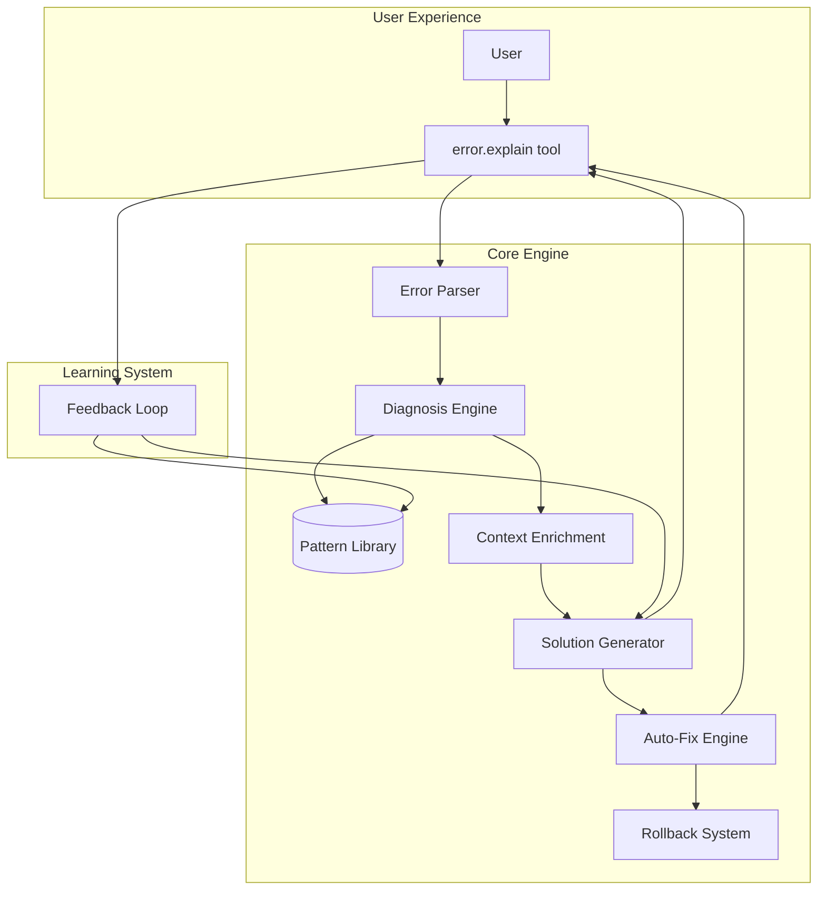

# ALECS Hero Features Roadmap

## 🏆 The Vision: "Explain and Fix My Akamai Error"

Transform the most frustrating part of Akamai development - cryptic errors - into a delightful experience where errors are automatically diagnosed, explained in plain English, and often auto-fixed.

## Why This Is THE Hero Feature

- **Universal Pain Point**: Every Akamai developer has wasted hours on cryptic errors
- **Immediate Value**: Provides help in the moment of highest frustration  
- **AI Superpower**: Perfect use case for LLM understanding and context
- **Measurable Impact**: Reduces debugging time from hours to seconds
- **Wow Factor**: "I can't believe it just fixed that automatically!"

## 🎯 Success Metrics

- **Error Resolution Time**: 95% reduction (hours → seconds)
- **First-Fix Success Rate**: 80%+ errors resolved on first attempt
- **User Satisfaction**: "This saved my day" feedback
- **Support Ticket Reduction**: 50% fewer Akamai support tickets
- **Adoption Rate**: Used in 90%+ of error scenarios

## 📋 Implementation Roadmap

### Phase 1: Foundation (Weeks 1-2)
**Goal**: Build core error understanding

#### Issue #1: Error Pattern Library
- Collect and categorize 150+ error patterns
- Document causes and solutions
- Create pattern matching rules
- **Deliverable**: Comprehensive error database

#### Issue #2: Error Diagnosis Engine  
- Parse complex Akamai error structures
- Match errors to patterns
- Extract context and metadata
- **Deliverable**: 95%+ error parsing accuracy

### Phase 2: Intelligence (Weeks 3-4)
**Goal**: Generate smart solutions

#### Issue #3: Context Enrichment System
- Gather user permissions and access
- Track operation history
- Monitor resource states
- **Deliverable**: Rich context for every error

#### Issue #4: Solution Generator
- Generate actionable solutions
- Provide step-by-step instructions
- Rank by success probability
- **Deliverable**: 2+ solutions per error

### Phase 3: Automation (Weeks 5-6)
**Goal**: Enable auto-fixing

#### Issue #5: Auto-Fix Engine
- Identify fixable errors
- Generate safe fix strategies
- Preview changes
- Execute with rollback
- **Deliverable**: 60%+ errors auto-fixable

### Phase 4: User Experience (Weeks 7-8)
**Goal**: Seamless integration

#### Issue #6: error.explain Tool
- Natural language interface
- Multi-language support
- Batch error analysis
- Learning recommendations
- **Deliverable**: Production-ready tool

## 🔧 Technical Architecture



## 📊 Example User Journey

### Before Hero Feature
```
1. User: Creates property
2. Error: "403 Forbidden"
3. User: "What does this mean?"
4. Google: 20 minutes searching
5. Support: Opens ticket
6. Wait: 2-4 hours
7. Support: "Try different contract"
8. User: Finally works
Total time: 4+ hours
```

### After Hero Feature
```
1. User: Creates property
2. Error: "403 Forbidden"
3. User: await error.explain(error)
4. System: "You don't have access to this contract. 
           I found 3 contracts you can use."
5. User: "Fix it"
6. System: "Done! Property created with contract ctr_XYZ"
Total time: 30 seconds
```

## 🚀 Quick Wins Along the Way

### Week 1
- Basic error parser working
- First 50 patterns documented

### Week 2  
- Diagnosis engine matching errors
- 80%+ accuracy on common errors

### Week 3
- Context enrichment live
- Solutions generated automatically

### Week 4
- First auto-fix working
- Permission errors solved automatically

## 🎁 Bonus Features (Post-Launch)

1. **Predictive Warnings**: "This will likely fail because..."
2. **Error Prevention**: "Before you run this, fix X"
3. **Team Learning**: Share error solutions across team
4. **Custom Patterns**: Add company-specific error patterns

## 📈 Competitive Advantage

This feature would make ALECS the ONLY MCP server that:
- Turns errors into solutions automatically
- Saves hours of developer time per week
- Makes Akamai accessible to beginners
- Provides "magical" AI moments

## 🤝 Getting Started

1. **Gather Error Examples**: Start collecting real errors from users
2. **Build Pattern Library**: Document the most common 20 errors first
3. **Create Parser**: Handle Akamai's problem JSON format
4. **Test with Users**: Get feedback on explanations
5. **Iterate**: Improve based on real usage

---

**This hero feature transforms the worst part of Akamai development into a showcase of AI assistance. It's not just a feature - it's a game changer.**