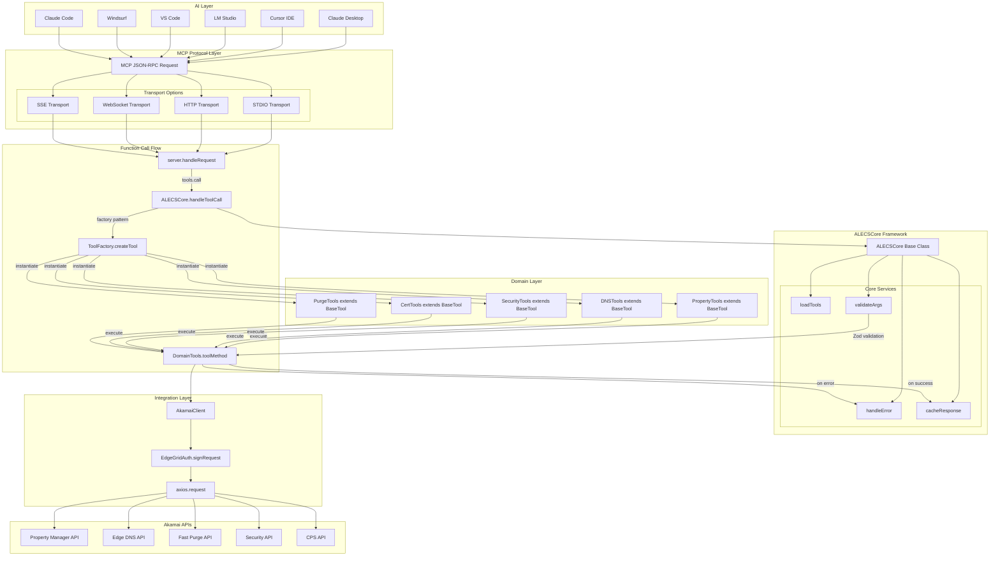
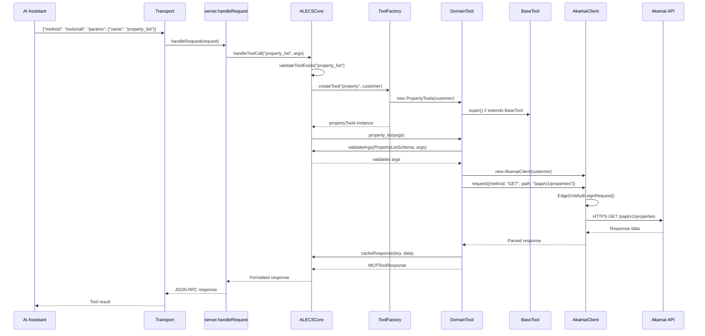
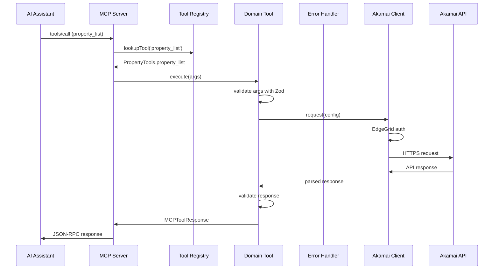
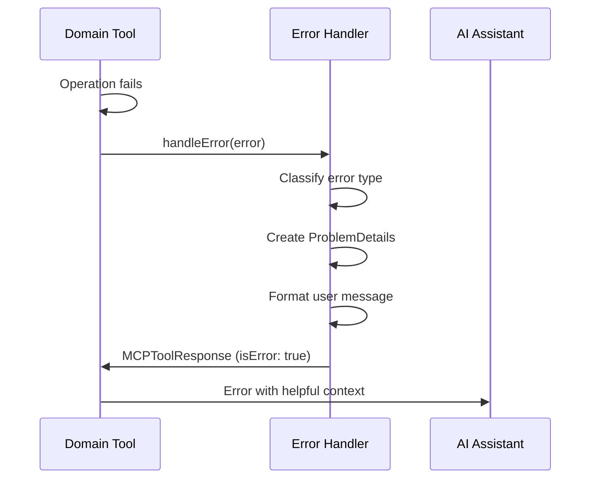
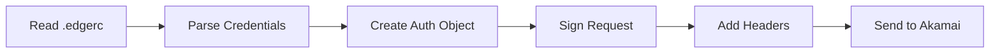
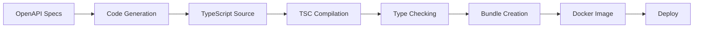

# ALECS Architecture Explainer

## Table of Contents
1. [Overview](#overview)
2. [Core Architecture](#core-architecture)
3. [Component Breakdown](#component-breakdown)
4. [Request Flow](#request-flow)
5. [Design Patterns](#design-patterns)
6. [Security Architecture](#security-architecture)
7. [Scalability & Performance](#scalability--performance)
8. [Development Workflow](#development-workflow)

## Overview

ALECS (A Launchgrid for Edge & Cloud Services) is a Model Context Protocol (MCP) server that bridges AI assistants with Akamai's CDN and edge services. The architecture is designed for:

- **Multi-tenant support** - Handle multiple Akamai customers
- **Type safety** - Zero runtime errors from type issues
- **Extensibility** - Easy addition of new services
- **Performance** - Efficient request handling and caching
- **Security** - EdgeGrid authentication and secure credential management

## Core Architecture



## Component Breakdown

### 1. MCP Server Layer

**Purpose**: Handle communication with AI assistants using the Model Context Protocol.

```typescript
// Core server implementation
export class AkamaiMCPServer {
  private server: Server;
  private tools: Map<string, ToolDefinition>;
  
  constructor(config: ServerConfig) {
    this.server = new Server(config);
    this.loadTools();
    this.setupHandlers();
  }
}
```

**Key Components**:
- **Server Instance**: Manages MCP protocol communication
- **Transport Handlers**: Support for stdio, HTTP, WebSocket, SSE
- **Tool Registry**: Dynamic tool loading and discovery
- **Request Router**: Routes MCP requests to appropriate handlers

### 2. ALECSCore Framework

**Purpose**: Base server class that provides core functionality for all domain servers.

```typescript
// ALECSCore base class
export class ALECSCore extends Server {
  tools: Tool[] = [];
  
  constructor(name: string) {
    super({
      name,
      version: '1.0.0'
    }, {
      capabilities: {
        tools: {}
      }
    });
  }
  
  // Core services provided
  protected loadTools(): void { }
  protected setupErrorHandling(): void { }
  protected initializeLogging(): void { }
  protected configureCaching(): void { }
}

// Domain servers extend ALECSCore
export class PropertyServerALECSCore extends ALECSCore {
  override tools = propertyTools;
}
```

**Key Features**:
- **Tool Auto-discovery**: Automatically loads and registers tools
- **Standardized Error Handling**: Consistent error responses across all domains
- **Built-in Logging**: Structured logging with Pino
- **Caching Framework**: Response caching with TTL support
- **Hot Reload Support**: Development mode with automatic reloading
- **Type Safety**: Full TypeScript support with generics

### 3. Transport Layer

**Purpose**: Support multiple communication protocols for different deployment scenarios.

```typescript
// Transport abstraction
interface Transport {
  start(): Promise<void>;
  send(message: JSONRPCMessage): Promise<void>;
  onMessage(handler: MessageHandler): void;
  close(): Promise<void>;
}

// Implementations
class StdioTransport implements Transport { }      // Claude Desktop
class HTTPTransport implements Transport { }        // Web/CDN deployment
class WebSocketTransport implements Transport { }   // Real-time communication
class SSETransport implements Transport { }         // Legacy support
```

### 3. Domain Tools Layer

**Purpose**: Implement business logic for each Akamai service domain.

```typescript
// Base tool pattern
export abstract class BaseTool {
  protected abstract client: AkamaiClient;
  protected abstract errorHandler: ToolErrorHandler;
  
  protected buildQueryParams(
    args: Record<string, any>, 
    keys: string[]
  ): Record<string, any> {
    // Common parameter building logic
  }
}

// Domain implementation
export class PropertyTools extends BaseTool {
  async property_list(args: PropertyListArgs): Promise<MCPToolResponse> {
    // Implementation with validation, error handling, logging
  }
}
```

### 4. Customer Management

**Purpose**: Handle multi-tenant scenarios with proper isolation.

```typescript
export class CustomerConfigManager {
  private configs: Map<string, CustomerConfig>;
  private edgercPath: string;
  
  async loadCustomerConfigs(): Promise<void> {
    // Load from .edgerc file
    // Validate credentials
    // Setup account switching
  }
  
  getClientForCustomer(customerId: string): AkamaiClient {
    // Return configured client with proper auth
  }
}
```

### 5. Schema Validation Layer

**Purpose**: Runtime validation of all inputs and outputs using Zod.

```typescript
// Schema definition
export const PropertyCreateSchema = z.object({
  customer: z.string().optional(),
  propertyName: z.string().min(1),
  contractId: z.string().regex(/^ctr_/),
  groupId: z.string().regex(/^grp_/),
  productId: z.string()
});

// Usage in tools
const validated = PropertyCreateSchema.parse(args);
```

### 6. Error Handling

**Purpose**: Consistent error handling following RFC 7807 Problem Details.

```typescript
export class ToolErrorHandler {
  handleError(error: unknown): MCPToolResponse {
    if (error instanceof AxiosError) {
      return this.handleApiError(error);
    }
    if (error instanceof z.ZodError) {
      return this.handleValidationError(error);
    }
    return this.handleUnknownError(error);
  }
  
  private handleApiError(error: AxiosError): MCPToolResponse {
    const problem: ProblemDetails = {
      type: `/errors/${error.response?.status || 500}`,
      title: this.getErrorTitle(error.response?.status),
      status: error.response?.status || 500,
      detail: error.response?.data?.detail || error.message,
      instance: `/tools/${this.tool}/${this.operation}`
    };
    
    return {
      content: [{
        type: 'text',
        text: this.formatProblemDetails(problem)
      }],
      isError: true
    };
  }
}
```

### 7. Akamai Client

**Purpose**: Handle all API communication with proper authentication.

```typescript
export class AkamaiClient {
  private auth: EdgeGridAuth;
  private axios: AxiosInstance;
  private queue: PQueue;
  
  constructor(customer: string = 'default') {
    this.auth = new EdgeGridAuth(customer);
    this.setupAxios();
    this.setupRateLimiting();
  }
  
  async request(config: RequestConfig): Promise<any> {
    // Add EdgeGrid authentication
    // Handle rate limiting
    // Retry logic
    // Response caching
  }
}
```

### 8. OpenAPI Integration

**Purpose**: Generate tools automatically from API specifications.

```typescript
export class OpenAPIGenerator {
  async generateFromSpec(spec: OpenAPISpec): Promise<GeneratedFiles> {
    const endpoints = this.parseEndpoints(spec);
    const schemas = this.extractSchemas(spec);
    
    return {
      tools: this.generateToolMethods(endpoints),
      schemas: this.generateZodSchemas(schemas),
      tests: this.generateTests(endpoints),
      docs: this.generateDocumentation(endpoints)
    };
  }
}
```

## Request Flow

### Function Call Sequence



### Standard Request Flow



### Error Flow



## Design Patterns

### 1. Factory Pattern
Used for creating domain-specific clients and tools:

```typescript
export class ToolFactory {
  static createTool(domain: string, customer: string): BaseTool {
    switch(domain) {
      case 'property': return new PropertyTools(customer);
      case 'dns': return new DNSTools(customer);
      // ...
    }
  }
}
```

### 2. Strategy Pattern
Used for transport selection:

```typescript
export class TransportStrategy {
  static getTransport(type: string): Transport {
    switch(type) {
      case 'stdio': return new StdioTransport();
      case 'http': return new HTTPTransport();
      // ...
    }
  }
}
```

### 3. Chain of Responsibility
Used in error handling:

```typescript
abstract class ErrorHandler {
  protected next?: ErrorHandler;
  
  setNext(handler: ErrorHandler): ErrorHandler {
    this.next = handler;
    return handler;
  }
  
  abstract handle(error: unknown): MCPToolResponse | null;
}
```

### 4. Singleton Pattern
Used for customer configuration manager:

```typescript
export class CustomerConfigManager {
  private static instance: CustomerConfigManager;
  
  static getInstance(): CustomerConfigManager {
    if (!this.instance) {
      this.instance = new CustomerConfigManager();
    }
    return this.instance;
  }
}
```

## Security Architecture

### 1. Credential Management
- Credentials stored in `.edgerc` file (never in code)
- Support for multiple customer sections
- Account switching via headers

### 2. Authentication Flow


### 3. Security Best Practices
- No hardcoded secrets
- Input validation on all parameters
- Output sanitization
- Rate limiting to prevent abuse
- Audit logging for all operations

## Scalability & Performance

### 1. Caching Strategy
```typescript
interface CacheConfig {
  ttl: number;          // Time to live in seconds
  customer: boolean;    // Customer-isolated caching
  invalidate: string[]; // Operations that invalidate cache
}

// Usage
@cache({ ttl: 300, customer: true })
async property_list(args: PropertyListArgs) {
  // Cached for 5 minutes per customer
}
```

### 2. Rate Limiting
```typescript
export class RateLimiter {
  private limits = {
    'property_*': { requests: 100, window: 60 },
    'fastpurge_*': { requests: 1000, window: 60 },
    'reporting_*': { requests: 10, window: 60 }
  };
}
```

### 3. Connection Pooling
- Reuse HTTPS connections
- Configurable pool size
- Keep-alive settings

### 4. Async Processing
- Queue management for bulk operations
- Progress tracking for long-running tasks
- Graceful shutdown handling

## Development Workflow

### 1. Adding New Tools

#### Manual Approach:
```bash
# Generate domain scaffold
alecs generate domain my-domain

# Implement tools in my-domain-tools.ts
# Add schemas in my-domain-schemas.ts
# Write tests in __tests__/
# Register in all-tools-registry.ts
```

#### OpenAPI Approach (Recommended):
```bash
# Generate from API specification
alecs generate-from-api --spec ./openapi.json --domain my-domain

# Everything is generated automatically:
# - Type-safe implementations
# - Zod schemas
# - Tests
# - Documentation
```

### 2. Testing Architecture

```typescript
// Unit tests for individual tools
describe('PropertyTools', () => {
  // Mock dependencies
  // Test success paths
  // Test error scenarios
  // Verify validation
});

// Integration tests
describe('Property Management Flow', () => {
  // Test complete workflows
  // Verify multi-tool operations
  // Check state consistency
});

// E2E tests with MCP protocol
describe('MCP Protocol Compliance', () => {
  // Test JSON-RPC communication
  // Verify protocol compliance
  // Check transport handling
});
```

### 3. Building & Deployment



## Key Architectural Decisions

### 1. TypeScript First
- **Decision**: Use TypeScript with strict mode
- **Rationale**: Catch errors at compile time, better IDE support
- **Trade-off**: Slightly longer build times

### 2. Zod for Runtime Validation
- **Decision**: Validate all inputs/outputs with Zod
- **Rationale**: Type safety at runtime, not just compile time
- **Trade-off**: Small performance overhead

### 3. Domain-Driven Design
- **Decision**: Organize code by Akamai service domains
- **Rationale**: Clear boundaries, easier to maintain
- **Trade-off**: Some code duplication across domains

### 4. OpenAPI-First Development
- **Decision**: Generate code from API specifications
- **Rationale**: Always in sync with APIs, faster development
- **Trade-off**: Less flexibility for custom logic

### 5. Multi-Transport Support
- **Decision**: Support stdio, HTTP, WebSocket, SSE
- **Rationale**: Deploy anywhere, support all MCP clients
- **Trade-off**: More complex transport abstraction

## Future Architecture Considerations

### 1. Microservices Migration
- Split domains into separate services
- Independent scaling per domain
- Kubernetes deployment

### 2. Event-Driven Architecture
- WebSocket subscriptions for real-time updates
- Event sourcing for audit trails
- CQRS for read/write optimization

### 3. GraphQL Gateway
- Unified query interface
- Better client flexibility
- Reduced over-fetching

### 4. Edge Deployment
- Deploy on Akamai EdgeWorkers
- Reduce latency
- Closer to the APIs

## Conclusion

The ALECS architecture is designed to be:
- **Maintainable**: Clear separation of concerns
- **Scalable**: From single customer to enterprise
- **Reliable**: Comprehensive error handling
- **Secure**: Industry best practices
- **Developer-Friendly**: Easy to extend and test

The combination of MCP protocol support, type safety, and OpenAPI-driven development creates a robust platform for AI-assisted Akamai management.