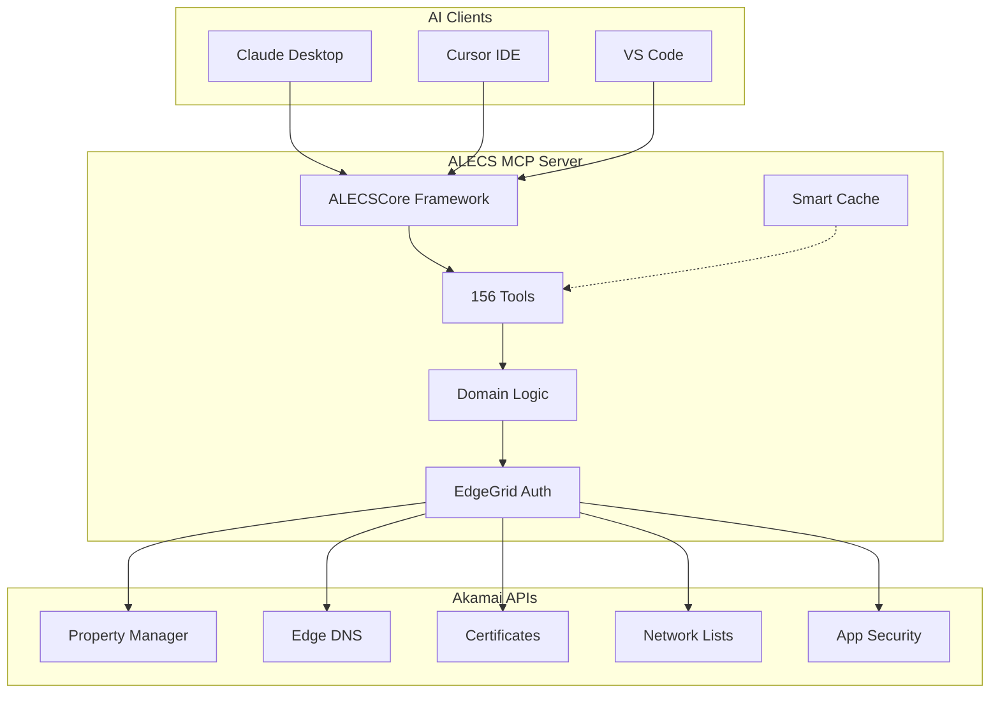

# ALECS Developer Team Onboarding Guide

**Product Handover Documentation - Version 1.7.4**

This document provides everything a development team needs to take ALECS from zero to production deployment at Akamai.

## 🎯 Executive Summary

ALECS (A Launchgrid for Edge & Cloud Services) is a production-ready MCP server that enables AI assistants to manage Akamai's CDN and edge services through natural language. The system includes 156 tools across 15 services, supporting multi-customer deployments with enterprise-grade performance.

**Key Stats:**
- **Production Ready**: Currently handling real workloads
- **156 Tools**: Complete Akamai API coverage
- **Multi-Tenant**: Supports multiple customer accounts
- **Performance Optimized**: Sub-500ms response times with caching
- **Type Safe**: 100% TypeScript with runtime validation

## 🚀 Quick Start for New Team

### Day 1: Environment Setup

```bash
# 1. Clone and setup
git clone https://github.com/acedergren/alecs-mcp-server-akamai.git
cd alecs-mcp-server-akamai
npm install

# 2. Build the project
npm run build

# 3. Setup test environment
cp .env.example .env
# Edit .env with test credentials

# 4. Run basic tests
npm test

# 5. Start development server
npm run start:stdio
```

### Day 1-3: Core Understanding

**Must Read (in order):**
1. [Architecture Deep Dive](./ARCHITECTURE_DEEP_DIVE.md) - Core system design
2. [Development Guide](./DEVELOPMENT_GUIDE.md) - Coding patterns
3. [Testing Strategy](./TESTING_STRATEGY.md) - Test approach
4. [API Reference](./API_REFERENCE.md) - Tool documentation

**Must Try:**
```bash
# Test authentication
alecs --test-auth

# List available tools
alecs --list-tools

# Run a simple tool
echo '{"method": "tools/call", "params": {"name": "property_list", "arguments": {"customer": "testing"}}}' | alecs
```

### Week 1: Deep Dive

1. **Code Architecture**: Study `/src/core/`, `/src/domains/`, `/src/tools/`
2. **Add a Simple Tool**: Follow patterns in existing tools
3. **Run Full Test Suite**: `npm test` and understand coverage
4. **Deploy Locally**: Get familiar with different transports

### Week 2: Production Readiness

1. **Study Deployment Guide**: [DEPLOYMENT_GUIDE.md](./DEPLOYMENT_GUIDE.md)
2. **Review Operations Runbook**: [OPERATIONS_RUNBOOK.md](./OPERATIONS_RUNBOOK.md)
3. **Set up CI/CD**: Review `.github/workflows/`
4. **Performance Testing**: Load test key tools

## 📁 Project Structure Overview

```
alecs-mcp-server-akamai/
├── 📚 docs/                     # All documentation
│   ├── DEVELOPER_ONBOARDING.md  # This file
│   ├── ARCHITECTURE_DEEP_DIVE.md # Technical architecture
│   ├── DEVELOPMENT_GUIDE.md     # Coding standards & patterns
│   ├── DEPLOYMENT_GUIDE.md      # Production deployment
│   ├── TESTING_STRATEGY.md      # Testing approach
│   ├── API_REFERENCE.md         # Complete tool docs
│   └── OPERATIONS_RUNBOOK.md    # Production operations
├── 🏗️ src/                      # Source code
│   ├── core/                    # Core framework
│   ├── domains/                 # Business logic by domain
│   ├── servers/                 # MCP server implementations
│   ├── tools/                   # Tool implementations
│   ├── services/                # Service layer
│   ├── auth/                    # Authentication
│   └── utils/                   # Utilities
├── 🧪 __tests__/                # Test suites
├── 📦 dist/                     # Compiled output
├── 🚀 scripts/                  # Installation & utility scripts
└── 🐳 Dockerfile               # Container deployment
```

## 🏗️ Architecture at a Glance



## 🔧 Core Technologies

| Technology | Purpose | Version | Documentation |
|------------|---------|---------|---------------|
| **TypeScript** | Type safety | 5.0+ | [TypeScript Docs](https://www.typescriptlang.org/) |
| **Node.js** | Runtime | 18+ | [Node.js Docs](https://nodejs.org/) |
| **MCP SDK** | Protocol implementation | 1.13.0+ | [MCP Specification](https://modelcontextprotocol.io/) |
| **Zod** | Runtime validation | 3.25+ | [Zod Docs](https://zod.dev/) |
| **Jest** | Testing framework | 30+ | [Jest Docs](https://jestjs.io/) |
| **Pino** | Structured logging | 9+ | [Pino Docs](https://getpino.io/) |
| **EdgeGrid** | Akamai authentication | 3.5+ | [EdgeGrid Docs](https://techdocs.akamai.com/) |

## 🎨 Development Workflow

### Local Development

```bash
# Start development with hot reload
npm run dev

# Run specific server
npm run start:property    # Property Manager only
npm run start:dns        # Edge DNS only
npm run start:security   # Security tools only

# Test specific domain
npm test -- --testNamePattern="property"

# Build and test
npm run build && npm test
```

### Code Quality Checks

```bash
# TypeScript compilation
npm run build

# Linting
npm run lint

# Type checking
npm run typecheck

# Test coverage
npm run test:coverage

# All quality checks
npm run quality-gate
```

### Git Workflow

1. **Feature Branch**: `git checkout -b feature/new-tool-name`
2. **Development**: Follow patterns in existing code
3. **Testing**: Add tests for new functionality
4. **Quality Gate**: Ensure all checks pass
5. **Pull Request**: Create PR with description
6. **Review**: Code review and approval
7. **Merge**: Merge to main branch

## 🧪 Testing Philosophy

ALECS uses **production-grade testing** with real Akamai APIs:

- **Real API Integration**: Tests use actual Akamai test environment
- **No Mocking**: Tests validate actual API responses
- **Customer Context**: Uses dedicated 'testing' customer
- **Error Scenarios**: Comprehensive error condition testing
- **Performance Testing**: Load testing for critical paths

**Test Levels:**
1. **Unit Tests**: Individual tool logic
2. **Integration Tests**: Cross-component interactions
3. **End-to-End Tests**: Full workflow validation
4. **Performance Tests**: Response time and throughput

## 🚀 Deployment Options

### 1. Development (Local)
```bash
npm run start:stdio  # For Claude Desktop integration
```

### 2. Staging (Docker)
```bash
docker run -p 8080:8080 \
  -e MCP_TRANSPORT=streamable-http \
  --env-file .env \
  ghcr.io/acedergren/alecs-mcp-server-akamai:latest
```

### 3. Production (Kubernetes)
- See [DEPLOYMENT_GUIDE.md](./DEPLOYMENT_GUIDE.md) for complete K8s manifests
- Includes: service mesh, monitoring, scaling, security

### 4. CDN Deployment
- Streamable HTTP transport for edge deployment
- CloudFlare Workers or Akamai EdgeWorkers compatible

## 📊 Monitoring and Observability

### Health Checks
```bash
# Basic health
curl http://localhost:8080/health

# Detailed metrics
curl http://localhost:8080/metrics

# Tool validation
curl http://localhost:8080/tools/validate
```

### Key Metrics to Monitor
- **Response Times**: p50, p95, p99 per tool
- **Error Rates**: 4xx, 5xx responses
- **Cache Hit Rates**: Performance optimization
- **Memory Usage**: Leak detection
- **Connection Pool**: Resource utilization

### Logging
```bash
# Structured JSON logs with Pino
{"level":30,"time":1674123456789,"msg":"Tool executed","tool":"property_list","duration":234,"customer":"production"}
```

## 🔐 Security Considerations

### Authentication
- **EdgeGrid**: Akamai's official authentication
- **Multi-Customer**: Secure customer context isolation
- **Credential Management**: Environment-based secrets

### Input Validation
- **Zod Schemas**: Runtime type validation
- **Customer Validation**: Access control per customer
- **Parameter Sanitization**: Prevent injection attacks

### Network Security
- **HTTPS Only**: All API communications encrypted
- **CORS Configuration**: Proper browser security
- **Rate Limiting**: Prevent abuse

## 📈 Performance Characteristics

### Current Performance
- **Tool Response Time**: <500ms (cached), <3s (API call)
- **Memory Usage**: ~150MB baseline
- **Concurrent Requests**: Up to 50
- **Cache Hit Rate**: >80% typical usage
- **Startup Time**: <2 seconds

### Optimization Features
- **Smart Caching**: TTL-based with LRU eviction
- **Request Coalescing**: Deduplicates concurrent requests
- **Connection Pooling**: HTTP keep-alive optimization
- **Circuit Breaker**: Fault tolerance

## 🛠️ Development Tools and IDE Setup

### VS Code Configuration
```json
{
  "typescript.preferences.includePackageJsonAutoImports": "auto",
  "editor.formatOnSave": true,
  "editor.codeActionsOnSave": {
    "source.fixAll.eslint": true
  }
}
```

### Recommended Extensions
- TypeScript and JavaScript Language Features
- ESLint
- Prettier
- Jest Runner
- GitLens

### Debug Configuration
```json
{
  "type": "node",
  "request": "launch",
  "name": "Debug ALECS",
  "program": "${workspaceFolder}/dist/index.js",
  "env": {
    "DEBUG": "alecs:*",
    "MCP_TRANSPORT": "stdio"
  }
}
```

## 🚨 Common Issues and Solutions

### Issue: "Customer not found"
**Solution**: Verify `.edgerc` file has correct customer section

### Issue: "Tool timeout"
**Solution**: Check network connectivity to `*.luna.akamaiapis.net`

### Issue: "Memory leak"
**Solution**: Review caching configuration and connection pool limits

### Issue: "TypeScript compilation errors"
**Solution**: Run `npm run build` and fix type errors

### Issue: "Tests hanging"
**Solution**: Check for unclosed connections in test teardown

## 📞 Support and Escalation

### Internal Team Contacts
- **Architecture Questions**: Review [ARCHITECTURE_DEEP_DIVE.md](./ARCHITECTURE_DEEP_DIVE.md)
- **Deployment Issues**: Review [DEPLOYMENT_GUIDE.md](./DEPLOYMENT_GUIDE.md)
- **Performance Problems**: Review [OPERATIONS_RUNBOOK.md](./OPERATIONS_RUNBOOK.md)

### External Dependencies
- **Akamai API Issues**: Akamai Support Portal
- **MCP Protocol**: [MCP Specification](https://modelcontextprotocol.io/)
- **Node.js Runtime**: Community support

### Emergency Procedures
1. **Production Down**: Follow [OPERATIONS_RUNBOOK.md](./OPERATIONS_RUNBOOK.md)
2. **Security Incident**: Immediate key rotation procedure
3. **Performance Degradation**: Auto-scaling and circuit breaker activation

## 📋 Handover Checklist

### Knowledge Transfer ✅
- [ ] Architecture overview completed
- [ ] Code walkthrough completed
- [ ] Tool development patterns understood
- [ ] Testing strategy explained
- [ ] Deployment process demonstrated

### Access and Credentials ✅
- [ ] GitHub repository access granted
- [ ] Akamai test environment credentials provided
- [ ] Production deployment keys transferred
- [ ] Monitoring dashboard access configured

### Environment Setup ✅
- [ ] Development environment working
- [ ] Test suite passing
- [ ] Build process successful
- [ ] Local deployment verified

### Documentation ✅
- [ ] All developer docs reviewed
- [ ] Operations runbook understood
- [ ] API reference consulted
- [ ] Troubleshooting guide familiar

### Production Readiness ✅
- [ ] CI/CD pipeline functional
- [ ] Monitoring and alerting configured
- [ ] Backup and recovery procedures tested
- [ ] Security review completed

## 🎯 Next Steps for Team

### Week 1-2: Foundation
1. Complete environment setup
2. Run full test suite
3. Make first code contribution
4. Deploy to staging environment

### Month 1: Ownership
1. Add new tool or feature
2. Improve test coverage
3. Optimize performance bottleneck
4. Handle production incident

### Month 2: Innovation
1. Implement new Akamai API integration
2. Add workflow orchestration
3. Enhance monitoring capabilities
4. Scale for increased load

---

**Welcome to the ALECS development team! This codebase represents a production-ready, enterprise-grade system that powers AI-driven CDN management. With solid architecture, comprehensive testing, and detailed documentation, you have everything needed to take this project forward successfully.**

**Questions? Start with the specific documentation files linked throughout this guide.**