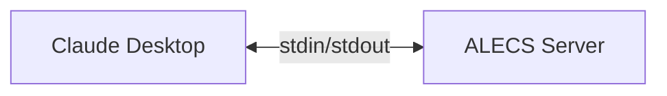
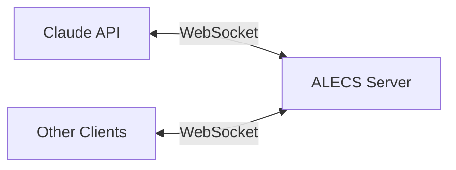
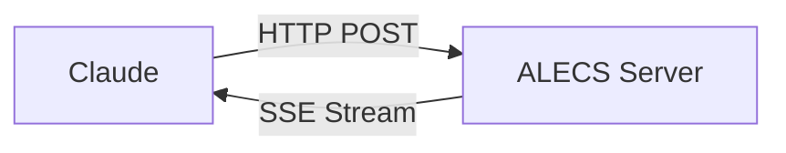

# MCP Integration Guide for ALECS

## What is MCP?

The Model Context Protocol (MCP) is a standard for connecting AI assistants to external tools and data sources. ALECS implements MCP to give Claude and other AI assistants structured access to Akamai's CDN platform.

## How ALECS Implements MCP

### 1. Tool Naming Convention

ALECS uses a hierarchical naming pattern for clarity:

```
service.resource.action
```

Examples:
- `property.list` - List properties
- `dns.record.create` - Create DNS record
- `certs.enrollment.status` - Check certificate status

### 2. Tool Definition Structure

```typescript
{
  name: "property.create",
  description: "Create a new Akamai property",
  inputSchema: {
    type: "object",
    properties: {
      propertyName: {
        type: "string",
        description: "Name for the property"
      },
      productId: {
        type: "string",
        description: "Product ID (e.g., 'prd_Download_Delivery')"
      },
      customer: {
        type: "string",
        description: "Customer account (optional)"
      }
    },
    required: ["propertyName", "productId"]
  }
}
```

### 3. Request/Response Flow

```mermaid
sequenceDiagram
    participant Claude
    participant MCP
    participant Tool
    participant Akamai
    
    Claude->>MCP: tools/call
    Note over MCP: {
        "name": "property.list",
        "arguments": {
            "customer": "acme"
        }
    }
    
    MCP->>Tool: Validate & Route
    Tool->>Akamai: GET /properties
    Akamai-->>Tool: Response
    Tool-->>MCP: Format Result
    
    MCP-->>Claude: tool/result
    Note over Claude: {
        "content": [{
            "type": "text",
            "text": "Found 3 properties..."
        }]
    }
```

## MCP Features in ALECS

### 1. Structured Tool Responses

ALECS formats all responses for optimal AI consumption:

```json
{
  "content": [
    {
      "type": "text",
      "text": "Successfully created property 'my-website' (prp_123456)"
    }
  ],
  "isError": false
}
```

### 2. Error Handling

MCP-compliant error responses with helpful context:

```json
{
  "content": [
    {
      "type": "text",
      "text": "Error: Property 'my-site' already exists (prp_789012)\n\nSuggestion: Use a different name or update the existing property."
    }
  ],
  "isError": true
}
```

### 3. Multi-Customer Context

Every tool accepts an optional `customer` parameter:

```typescript
// Tool call with customer context
{
  "name": "property.list",
  "arguments": {
    "customer": "staging",  // Uses ~/.edgerc[staging]
    "includeRules": false
  }
}
```

## Transport Modes

### 1. STDIO (Default for Claude Desktop)



Configuration:
```json
{
  "mcpServers": {
    "alecs-akamai": {
      "command": "node",
      "args": ["path/to/alecs/dist/index.js"]
    }
  }
}
```

### 2. WebSocket (Remote Access)



Start server:
```bash
MCP_TRANSPORT=websocket node dist/index.js
```

### 3. SSE (Server-Sent Events)



## Best Practices

### 1. Tool Design

**DO:**
- Use clear, descriptive names
- Provide helpful descriptions
- Include examples in descriptions
- Return structured data

**DON'T:**
- Use ambiguous names
- Return unformatted text
- Hide error details
- Assume context

### 2. Parameter Validation

```typescript
// Good: Clear validation with helpful errors
if (!propertyName || propertyName.length < 3) {
  throw new Error(
    "Property name must be at least 3 characters long. " +
    "Example: 'my-website' or 'api-gateway'"
  );
}

// Bad: Generic validation
if (!propertyName) {
  throw new Error("Invalid input");
}
```

### 3. Response Formatting

```typescript
// Good: Structured response with context
return {
  content: [{
    type: "text",
    text: `Created property '${propertyName}' (${propertyId})
    
Next steps:
1. Add hostnames: "Add www.example.com to ${propertyName}"
2. Configure rules: "Show rules for ${propertyName}"
3. Activate: "Activate ${propertyName} to staging"`
  }]
};

// Bad: Minimal response
return {
  content: [{
    type: "text",
    text: "OK"
  }]
};
```

## Debugging MCP

### 1. Enable Debug Logging

```bash
# Set environment variable
export DEBUG=mcp:*
export ALECS_LOG_LEVEL=debug

# Run server
node dist/index.js
```

### 2. Test Tool Calls

```bash
# Send test MCP request
echo '{"jsonrpc":"2.0","method":"tools/list","id":1}' | node dist/index.js
```

### 3. Validate Tool Schema

```typescript
// Test tool definition
import { validateToolSchema } from '@modelcontextprotocol/sdk';

const tool = {
  name: "property.create",
  inputSchema: { /* ... */ }
};

validateToolSchema(tool); // Throws if invalid
```

## Common Integration Patterns

### 1. Progressive Disclosure

Start simple, offer more details:

```typescript
// Initial response
"Found 15 properties in your account"

// If user asks for details
"Here are your properties:
1. my-website (prp_123) - Production
2. api-gateway (prp_456) - Staging
..."
```

### 2. Guided Workflows

Help users through complex tasks:

```typescript
// After creating property
"Property created! Would you like to:
- Add hostnames to the property
- Configure caching rules
- Set up SSL certificate"
```

### 3. Error Recovery

Suggest alternatives on failure:

```typescript
// On 404 error
"Property 'old-site' not found.

Did you mean one of these?
- old-site-backup (prp_789)
- old-site-staging (prp_012)

Or search: 'Find properties matching old'"
```

## Testing MCP Integration

### 1. Unit Tests

```typescript
describe('MCP Tool Integration', () => {
  it('should return MCP-compliant response', async () => {
    const result = await tool.handler({ propertyName: 'test' });
    
    expect(result).toHaveProperty('content');
    expect(result.content).toBeInstanceOf(Array);
    expect(result.content[0]).toHaveProperty('type', 'text');
  });
});
```

### 2. Integration Tests

```typescript
it('should handle MCP protocol flow', async () => {
  const server = new MCPServer();
  
  // Send MCP request
  const response = await server.handleRequest({
    jsonrpc: '2.0',
    method: 'tools/call',
    params: {
      name: 'property.list',
      arguments: {}
    },
    id: 1
  });
  
  expect(response.result).toBeDefined();
});
```

## Future MCP Enhancements

### 1. Streaming Responses

For long-running operations:

```typescript
// Future: Stream activation progress
{
  "type": "stream",
  "content": [
    { "progress": 10, "status": "Validating configuration..." },
    { "progress": 50, "status": "Deploying to edge servers..." },
    { "progress": 100, "status": "Activation complete!" }
  ]
}
```

### 2. Resource Attachments

Include relevant files:

```typescript
// Future: Attach configuration files
{
  "content": [{
    "type": "text",
    "text": "Property rules exported"
  }],
  "attachments": [{
    "type": "file",
    "name": "rules.json",
    "content": "..."
  }]
}
```

### 3. Interactive Forms

Guide complex inputs:

```typescript
// Future: Form-based input
{
  "type": "form",
  "fields": [
    { "name": "propertyName", "type": "text", "required": true },
    { "name": "productId", "type": "select", "options": [...] }
  ]
}
```

## Resources

- [MCP Specification](https://modelcontextprotocol.io/docs)
- [MCP SDK Documentation](https://github.com/modelcontextprotocol/sdk)
- [ALECS GitHub Repository](https://github.com/your-org/alecs-mcp-server-akamai)
- [Akamai API Documentation](https://techdocs.akamai.com)

---

Built with MCP for seamless AI integration 🤖