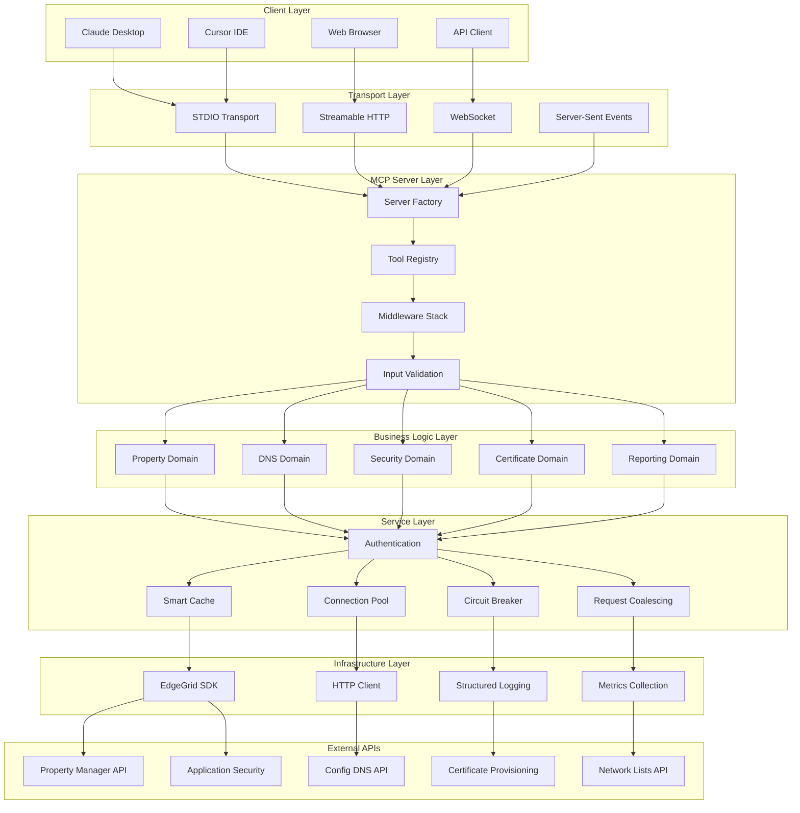
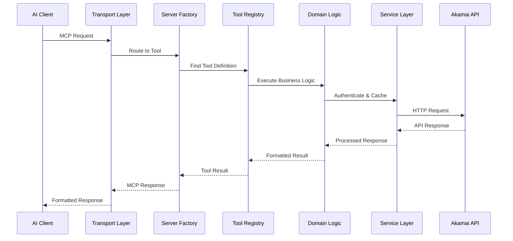
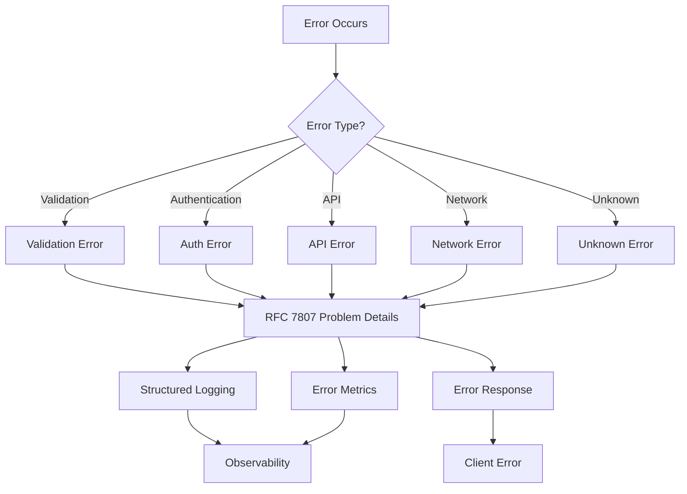

# ALECS Architecture Deep Dive

**Technical Architecture Documentation for Development Teams**

## 🏗️ System Overview

ALECS implements a layered architecture optimized for AI assistant integration with Akamai's APIs. The system prioritizes type safety, performance, and maintainability while supporting multi-tenant deployments at enterprise scale.



## 🏛️ Core Framework Architecture

### ALECSCore Framework

**Location**: `src/core/server/alecs-core.ts`

The foundation of all ALECS servers, providing:

```typescript
export abstract class ALECSCore {
  // Core components injected at startup
  protected cache: SmartCache;
  protected coalescer: RequestCoalescer;
  protected pool: ConnectionPool;
  protected circuit: CircuitBreaker;
  
  // Tool definitions - implemented by subclasses
  abstract tools: ToolDefinition[];
  
  // Tool helper function for simplified definition
  protected tool<T extends ZodSchema, R>(
    name: string,
    schema: T,
    handler: ToolHandler<z.infer<T>, R>,
    options?: ToolOptions
  ): ToolDefinition {
    return {
      name,
      description: options?.description || '',
      inputSchema: schema,
      handler: this.wrapHandler(handler, options),
      options
    };
  }
}
```

**Key Design Decisions**:

1. **Composition over Inheritance**: Core services injected rather than inherited
2. **Tool Helper Pattern**: Simplified tool definition with automatic optimization
3. **Performance by Default**: Caching, coalescing, and pooling built-in
4. **Type Safety**: Strong typing throughout the call chain

### Server Factory Pattern

**Location**: `src/utils/akamai-server-factory.ts`

Centralizes server creation and tool loading:

```typescript
export async function createAkamaiServer(options: ServerOptions): Promise<Server> {
  // 1. Load all tools from registry
  const allTools = getAllToolDefinitions();
  
  // 2. Apply filtering (if specified)
  const tools = options.toolFilter 
    ? allTools.filter(options.toolFilter)
    : allTools;
    
  // 3. Validate tool definitions
  const validation = validateAllTools(tools);
  if (!validation.valid) {
    throw new Error(`Tool validation failed: ${validation.errors.join(', ')}`);
  }
  
  // 4. Convert Zod schemas to JSON Schema for MCP
  const mcpTools = tools.map(convertToMCPTool);
  
  // 5. Create MCP server with tools
  return new Server({
    name: options.name,
    version: options.version
  }, {
    capabilities: {
      tools: mcpTools
    }
  });
}
```

### Tool Registry System

**Location**: `src/tools/all-tools-registry.ts`

Dynamic tool discovery and loading:

```typescript
// Centralized tool import and organization
const toolModules = {
  property: () => import('./property'),
  dns: () => import('./dns'),
  security: () => import('./security'),
  certificates: () => import('./certificates'),
  // ... other domains
};

export function getAllToolDefinitions(): ToolDefinition[] {
  const allTools: ToolDefinition[] = [];
  
  // Load tools from each domain module
  Object.entries(toolModules).forEach(([domain, loader]) => {
    const module = loader();
    const tools = convertDomainTools(module, domain);
    allTools.push(...tools);
  });
  
  return allTools;
}
```

## 🏢 Domain Architecture

### Domain-Driven Design

Each business domain follows consistent patterns:

```
src/domains/property/
├── index.ts              # Public API exports
├── operations.ts         # Core business operations  
├── types.ts             # Domain-specific types
├── schemas.ts           # Zod validation schemas
├── compatibility.ts     # Backwards compatibility
└── __tests__/           # Domain-specific tests
```

### Domain Implementation Pattern

**Example**: Property Domain (`src/domains/property/index.ts`)

```typescript
// Clean, hierarchical API design
export const property = {
  // Core operations
  list: listProperties,
  get: getProperty,
  create: createProperty,
  update: updateProperty,
  delete: deleteProperty,
  
  // Nested resource operations
  version: {
    create: createPropertyVersion,
    get: getPropertyVersion,
    list: listPropertyVersions,
    activate: activateProperty
  },
  
  rules: {
    get: getPropertyRules,
    update: updatePropertyRules,
    validate: validatePropertyRules
  },
  
  hostname: {
    add: addPropertyHostname,
    remove: removePropertyHostname,
    list: listPropertyHostnames
  }
};

// Implementation with type safety and error handling
export async function listProperties(
  args: ListPropertiesArgs
): Promise<PropertyListResponse> {
  const validated = ListPropertiesSchema.parse(args);
  const customer = safeExtractCustomer(validated);
  const client = new AkamaiClient(customer);
  
  try {
    const response = await client.request<RawPropertyListResponse>({
      path: '/papi/v1/properties',
      method: 'GET',
      queryParams: buildQueryParams(validated)
    });
    
    return transformPropertyList(response);
  } catch (error) {
    throw new PropertyError({
      type: '/errors/property-list-failed',
      title: 'Property List Failed',
      status: getStatusCode(error),
      detail: getErrorMessage(error),
      instance: 'property/list'
    });
  }
}
```

### Type System Architecture

**Zod Schema Pattern**:
```typescript
// Input validation with Zod
export const ListPropertiesSchema = z.object({
  customer: z.string().optional(),
  contractId: z.string().regex(/^ctr_/).optional(),
  groupId: z.string().regex(/^grp_/).optional(),
  includeDetails: z.boolean().default(false)
});

// Response type inference
export type ListPropertiesArgs = z.infer<typeof ListPropertiesSchema>;

// API response schemas for runtime validation
export const PropertyItemSchema = z.object({
  propertyId: z.string().regex(/^prp_/),
  propertyName: z.string(),
  accountId: z.string(),
  contractId: z.string().regex(/^ctr_/),
  groupId: z.string().regex(/^grp_/),
  latestVersion: z.number(),
  stagingVersion: z.number().optional(),
  productionVersion: z.number().optional()
});
```

## 🛠️ Tool Implementation Architecture

### BaseTool Pattern

**Location**: `src/tools/common/base-tool.ts`

Provides common patterns for all tool implementations:

```typescript
export abstract class BaseTool {
  protected abstract domain: string;
  
  // Type-safe request wrapper eliminates 'any' types
  protected async makeTypedRequest<T>(
    client: AkamaiClient,
    config: RequestConfig<T>
  ): Promise<T> {
    const response = await client.request(config);
    
    // Runtime validation of API response
    if (config.schema) {
      return config.schema.parse(response);
    }
    
    return response as T;
  }
  
  // Customer validation with error handling
  protected validateCustomer(args: any): string {
    const customer = safeExtractCustomer(args);
    if (!customer) {
      throw new ValidationError('Customer parameter required');
    }
    return customer;
  }
  
  // Standardized operation execution
  protected async executeStandardOperation<T>(
    operationName: string,
    args: any,
    operation: (client: AkamaiClient) => Promise<T>
  ): Promise<MCPToolResponse> {
    const customer = this.validateCustomer(args);
    const client = new AkamaiClient(customer);
    
    try {
      const result = await operation(client);
      return this.formatResponse(result, operationName);
    } catch (error) {
      return this.handleError(error, operationName);
    }
  }
}
```

### Consolidated Tool Pattern

**Example**: `src/tools/property/consolidated-property-tools.ts`

```typescript
export class ConsolidatedPropertyTools extends BaseTool {
  protected readonly domain = 'property';

  // Tool implementations follow consistent patterns
  async listProperties(args: ListPropertiesArgs): Promise<MCPToolResponse> {
    return this.executeStandardOperation(
      'list-properties',
      args,
      async (client) => {
        const response = await this.makeTypedRequest(client, {
          path: '/papi/v1/properties',
          method: 'GET',
          schema: PropertyListResponseSchema,
          queryParams: this.buildQueryParams(args)
        });
        
        return this.transformPropertyList(response);
      }
    );
  }
  
  async createProperty(args: CreatePropertyArgs): Promise<MCPToolResponse> {
    return this.executeStandardOperation(
      'create-property',
      args,
      async (client) => {
        const response = await this.makeTypedRequest(client, {
          path: '/papi/v1/properties',
          method: 'POST',
          schema: PropertyCreateResponseSchema,
          body: this.buildCreateRequest(args)
        });
        
        return this.transformPropertyCreate(response);
      }
    );
  }
}
```

### Server Implementation Pattern

**Example**: `src/servers/property-server-alecscore.ts`

```typescript
class PropertyServer extends ALECSCore {
  override tools = [
    // Simple tool definition with all optimizations
    this.tool(
      'list-properties',
      ListPropertiesSchema,
      async (args, ctx) => {
        const response = await property.list(args);
        return ctx.format(response);
      },
      {
        description: 'List all properties for a customer',
        cache: { ttl: 300 },     // Cache for 5 minutes
        coalesce: true,          // Deduplicate concurrent requests
        rateLimit: { rpm: 60 }   // Rate limiting
      }
    ),
    
    this.tool(
      'create-property',
      CreatePropertySchema,
      async (args, ctx) => {
        const response = await property.create(args);
        return ctx.format(response);
      },
      {
        description: 'Create a new property',
        cache: false,            // No caching for mutations
        coalesce: false,         // Each create is unique
        rateLimit: { rpm: 10 }   // Lower rate limit
      }
    )
  ];
}
```

## 🔐 Authentication Architecture

### Multi-Customer EdgeGrid Authentication

**Location**: `src/auth/EnhancedEdgeGrid.ts`

Enhanced EdgeGrid implementation with performance optimizations:

```typescript
export class EnhancedEdgeGrid extends EdgeGrid {
  private connectionPool: ConnectionPool;
  private circuitBreaker: CircuitBreaker;
  
  constructor(options: EdgeGridOptions) {
    super(options);
    
    // Performance optimizations
    this.connectionPool = new ConnectionPool({
      maxSockets: 50,
      keepAlive: true,
      timeout: 30000
    });
    
    this.circuitBreaker = new CircuitBreaker({
      threshold: 5,
      timeout: 60000,
      resetTimeout: 30000
    });
  }
  
  async _request<T>(options: RequestOptions): Promise<T> {
    // Circuit breaker protection
    if (this.circuitBreaker.isOpen()) {
      throw new ServiceUnavailableError('Circuit breaker open');
    }
    
    try {
      // Use connection pool for performance
      const response = await this.connectionPool.request(options);
      this.circuitBreaker.recordSuccess();
      return response;
    } catch (error) {
      this.circuitBreaker.recordFailure();
      throw error;
    }
  }
}
```

### Customer Context Management

**Location**: `src/services/customer-config-manager.ts`

```typescript
export class CustomerConfigManager {
  private configs: Map<string, CustomerConfig> = new Map();
  
  // Load customer configurations from .edgerc
  async loadConfigurations(): Promise<void> {
    const edgercPath = path.join(os.homedir(), '.edgerc');
    const content = await fs.readFile(edgercPath, 'utf8');
    
    const sections = this.parseEdgeRC(content);
    
    sections.forEach((config, sectionName) => {
      this.configs.set(sectionName, {
        ...config,
        validated: this.validateConfig(config)
      });
    });
  }
  
  // Get customer configuration with validation
  getCustomerConfig(customer: string): CustomerConfig {
    const config = this.configs.get(customer);
    if (!config) {
      throw new CustomerNotFoundError(`Customer '${customer}' not found`);
    }
    
    if (!config.validated) {
      throw new InvalidConfigError(`Customer '${customer}' has invalid configuration`);
    }
    
    return config;
  }
}
```

## ⚡ Performance Architecture

### Smart Caching System

**Location**: `src/core/server/performance/smart-cache.ts`

Intelligent caching with TTL management and customer segmentation:

```typescript
export class SmartCache {
  private cache: LRUCache<string, CacheEntry>;
  private metrics: CacheMetrics;
  
  constructor(options: CacheOptions) {
    this.cache = new LRUCache({
      max: options.maxSize || 10000,
      ttl: options.defaultTTL || 300000, // 5 minutes default
      updateAgeOnGet: true,
      allowStale: false
    });
    
    this.metrics = new CacheMetrics();
  }
  
  // Customer-aware cache key generation
  private buildKey(customer: string, operation: string, params: any): string {
    const paramHash = createHash('md5')
      .update(JSON.stringify(params))
      .digest('hex');
    return `${customer}:${operation}:${paramHash}`;
  }
  
  async get<T>(
    customer: string,
    operation: string,
    params: any,
    fetcher: () => Promise<T>
  ): Promise<T> {
    const key = this.buildKey(customer, operation, params);
    
    // Check cache first
    const cached = this.cache.get(key);
    if (cached) {
      this.metrics.recordHit(operation);
      return cached.data as T;
    }
    
    // Cache miss - fetch data
    this.metrics.recordMiss(operation);
    const data = await fetcher();
    
    // Store in cache with operation-specific TTL
    const ttl = this.getTTLForOperation(operation);
    this.cache.set(key, { data, timestamp: Date.now() }, { ttl });
    
    return data;
  }
}
```

### Request Coalescing

**Location**: `src/core/server/performance/request-coalescer.ts`

Deduplicates identical concurrent requests:

```typescript
export class RequestCoalescer {
  private pendingRequests: Map<string, Promise<any>> = new Map();
  
  async coalesce<T>(
    key: string,
    request: () => Promise<T>
  ): Promise<T> {
    // Check if identical request is already in progress
    const existing = this.pendingRequests.get(key);
    if (existing) {
      return existing as Promise<T>;
    }
    
    // Execute request and track it
    const promise = request()
      .finally(() => {
        // Clean up after completion
        this.pendingRequests.delete(key);
      });
    
    this.pendingRequests.set(key, promise);
    return promise;
  }
}
```

### Connection Pool Management

**Location**: `src/core/server/performance/connection-pool.ts`

HTTP connection pooling for performance:

```typescript
export class ConnectionPool {
  private agents: Map<string, Agent> = new Map();
  
  constructor(private options: PoolOptions) {}
  
  getAgent(hostname: string): Agent {
    let agent = this.agents.get(hostname);
    
    if (!agent) {
      agent = new Agent({
        keepAlive: true,
        keepAliveMsecs: 30000,
        maxSockets: this.options.maxSockets || 50,
        maxFreeSockets: this.options.maxFreeSockets || 10,
        timeout: this.options.timeout || 30000
      });
      
      this.agents.set(hostname, agent);
    }
    
    return agent;
  }
}
```

## 🔄 Workflow and Orchestration

### Workflow Engine Architecture

**Location**: `src/orchestration/workflow-engine.ts`

Coordinates complex multi-step operations:

```typescript
export interface WorkflowDefinition {
  id: string;
  name: string;
  description?: string;
  steps: WorkflowStep[];
  errorHandling?: ErrorHandlingStrategy;
  timeout?: number;
}

export interface WorkflowStep {
  id: string;
  name: string;
  tool: string;
  args: Record<string, any>;
  dependencies?: string[];
  retryPolicy?: RetryPolicy;
  timeout?: number;
}

export class WorkflowEngine {
  async execute(workflow: WorkflowDefinition): Promise<WorkflowResult> {
    const context = new WorkflowContext(workflow.id);
    const executor = new WorkflowExecutor(context);
    
    try {
      // Build dependency graph
      const graph = this.buildDependencyGraph(workflow.steps);
      
      // Execute steps in topological order
      const results = await executor.executeGraph(graph);
      
      return {
        success: true,
        results,
        duration: context.getDuration()
      };
    } catch (error) {
      return this.handleWorkflowError(error, context);
    }
  }
}
```

### MCP Tool Executor

**Location**: `src/orchestration/mcp-tool-executor.ts`

Executes MCP tools within workflow context:

```typescript
export class MCPToolExecutor {
  constructor(
    private server: Server,
    private context: WorkflowContext
  ) {}
  
  async executeTool(
    toolName: string,
    args: any
  ): Promise<any> {
    // Find tool definition
    const tool = this.server.getTool(toolName);
    if (!tool) {
      throw new ToolNotFoundError(`Tool '${toolName}' not found`);
    }
    
    // Validate arguments
    const validated = tool.inputSchema.parse(args);
    
    // Execute with context
    const result = await tool.handler(validated, this.context);
    
    // Record execution metrics
    this.context.recordToolExecution(toolName, result);
    
    return result;
  }
}
```

## 📊 Data Flow Architecture

### Request Processing Pipeline



### Error Handling Flow



## 🔒 Security Architecture

### Input Validation Pipeline

```typescript
// Multi-layer validation approach
export class ValidationPipeline {
  async validate(input: unknown, schema: ZodSchema): Promise<any> {
    // 1. Schema validation
    const validated = schema.parse(input);
    
    // 2. Customer access validation
    const customer = this.extractCustomer(validated);
    await this.validateCustomerAccess(customer);
    
    // 3. Parameter sanitization
    const sanitized = this.sanitizeParameters(validated);
    
    // 4. Business rule validation
    await this.validateBusinessRules(sanitized);
    
    return sanitized;
  }
}
```

### Customer Isolation

```typescript
// Customer context enforcement
export class CustomerContextManager {
  async createContext(customer: string): Promise<CustomerContext> {
    // Validate customer exists and user has access
    const config = await this.getCustomerConfig(customer);
    
    // Create isolated client instance
    const client = new AkamaiClient(config);
    
    // Create scoped cache
    const cache = this.cacheManager.getCustomerCache(customer);
    
    return new CustomerContext(customer, client, cache);
  }
}
```

## 📈 Monitoring and Observability

### Metrics Collection

**Location**: `src/utils/performance-monitor.ts`

```typescript
export class PerformanceMonitor {
  private metrics: MetricsRegistry;
  
  recordToolExecution(tool: string, duration: number, success: boolean): void {
    this.metrics.histogram('tool_duration_ms', duration, { tool, success });
    this.metrics.counter('tool_executions_total', 1, { tool, success });
  }
  
  recordCacheHit(operation: string, hit: boolean): void {
    this.metrics.counter('cache_operations_total', 1, { operation, hit });
  }
  
  recordAPICall(endpoint: string, statusCode: number, duration: number): void {
    this.metrics.histogram('api_duration_ms', duration, { endpoint, statusCode });
    this.metrics.counter('api_calls_total', 1, { endpoint, statusCode });
  }
}
```

### Health Check System

```typescript
export class HealthCheckManager {
  private checks: Map<string, HealthCheck> = new Map();
  
  async runHealthChecks(): Promise<HealthStatus> {
    const results = await Promise.allSettled(
      Array.from(this.checks.values()).map(check => check.execute())
    );
    
    const status = results.every(r => r.status === 'fulfilled' && r.value.healthy)
      ? 'healthy' 
      : 'unhealthy';
    
    return {
      status,
      timestamp: new Date().toISOString(),
      checks: this.processResults(results)
    };
  }
}
```

## 🎯 Architectural Decision Records

### ADR-001: Domain-Driven Design
**Decision**: Organize code by business domains (property, DNS, security) rather than technical layers.
**Rationale**: Better alignment with Akamai's API structure and team organization.

### ADR-002: Performance by Default
**Decision**: Build caching, coalescing, and pooling into the core framework.
**Rationale**: Sub-second response times are critical for AI assistant UX.

### ADR-003: Type Safety Throughout
**Decision**: Use TypeScript with runtime validation via Zod for all inputs/outputs.
**Rationale**: Prevents runtime errors and improves developer experience.

### ADR-004: Multi-Transport Support
**Decision**: Support stdio, HTTP, WebSocket, and SSE transports.
**Rationale**: Different deployment scenarios require different transport mechanisms.

### ADR-005: Customer Context Isolation
**Decision**: Enforce customer isolation at the framework level.
**Rationale**: Multi-tenant security and data isolation requirements.

---

This architecture provides a solid foundation for scaling ALECS from development to enterprise production deployment while maintaining code quality, performance, and security standards.