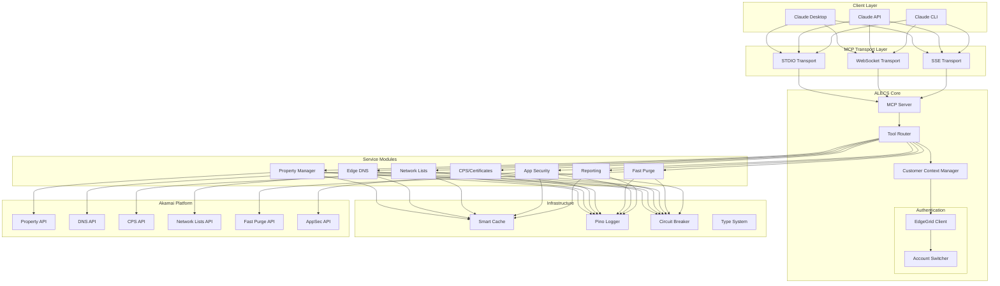
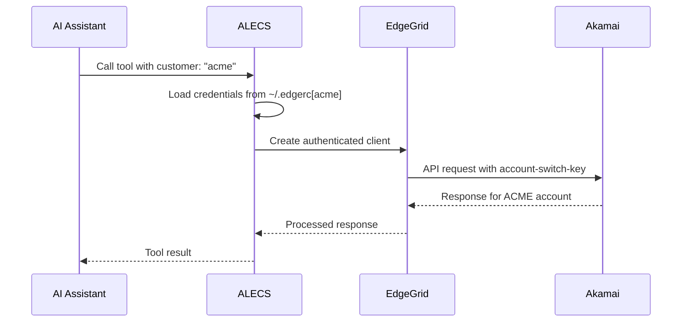
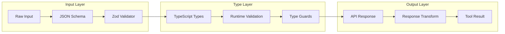
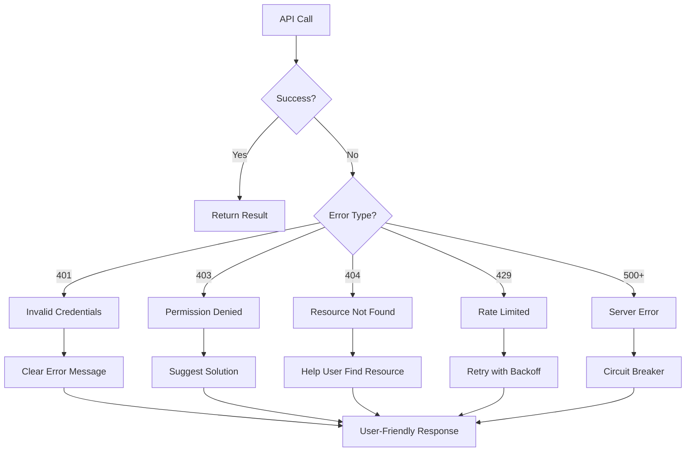
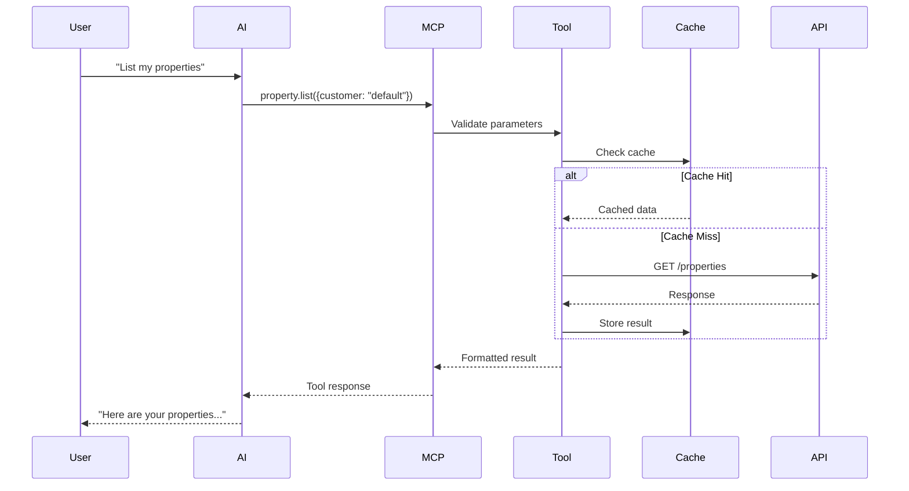
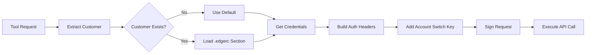

# ALECS Architecture Overview

## System Design

ALECS implements the Model Context Protocol (MCP) to provide AI assistants with structured access to Akamai's CDN platform. The architecture emphasizes modularity, type safety, and clear separation of concerns.

## Core Architecture Diagram



## Component Details

### 1. MCP Server Core

The heart of ALECS that implements the Model Context Protocol:

```typescript
class MCPServer {
  // Handles tool registration and routing
  registerTool(name: string, handler: ToolHandler)
  
  // Manages client connections
  handleConnection(transport: Transport)
  
  // Processes tool calls
  async callTool(name: string, params: any): Promise<ToolResult>
}
```

### 2. Multi-Customer Support



### 3. Service Module Pattern

Each service module follows a consistent pattern:

```typescript
interface ServiceModule {
  // Tool definitions
  tools: ToolDefinition[]
  
  // Shared client instance
  client: AkamaiClient
  
  // Service-specific methods
  list(): Promise<Item[]>
  get(id: string): Promise<Item>
  create(data: CreateData): Promise<Item>
  update(id: string, data: UpdateData): Promise<Item>
  delete(id: string): Promise<void>
}
```

### 4. Type Safety Architecture



### 5. Error Handling Flow



## Data Flow

### 1. Tool Call Lifecycle



### 2. Authentication Flow



## Design Principles

### 1. **Modularity**
- Each service is independent
- Tools can be loaded selectively
- Clear interfaces between components

### 2. **Type Safety**
- Full TypeScript coverage
- Runtime validation with Zod
- No `any` types in production code

### 3. **User Experience**
- Clear, actionable error messages
- Helpful suggestions on failures
- Progress indicators for long operations

### 4. **Performance**
- Smart caching with TTL
- Circuit breakers for resilience
- Concurrent request handling

### 5. **Security**
- Credentials never in code
- EdgeGrid authentication only
- Secure multi-tenant isolation

## Directory Structure

```
alecs-mcp-server-akamai/
├── src/
│   ├── index.ts              # Entry point
│   ├── server.ts             # MCP server implementation
│   ├── types/                # TypeScript types
│   ├── tools/                # Tool implementations
│   │   ├── property-tools.ts
│   │   ├── dns-tools.ts
│   │   ├── certs-tools.ts
│   │   └── ...
│   ├── services/             # Service modules
│   │   ├── property-manager/
│   │   ├── edge-dns/
│   │   └── ...
│   ├── utils/                # Utilities
│   │   ├── akamai-client.ts
│   │   ├── smart-cache.ts
│   │   └── logger.ts
│   └── auth/                 # Authentication
│       ├── edgegrid.ts
│       └── customer-context.ts
├── docs/                     # Documentation
├── __tests__/               # Test suite
└── scripts/                 # Build/deploy scripts
```

## Deployment Options

### 1. Claude Desktop (Recommended)
- Direct stdio communication
- No network overhead
- Instant responses

### 2. WebSocket Server
- Remote access capability
- Multiple concurrent clients
- Real-time communication

### 3. Docker Container
- Isolated environment
- Easy deployment
- Consistent dependencies

## Future Architecture Considerations

1. **Plugin System** - Dynamic tool loading
2. **Event Streaming** - Real-time updates
3. **Distributed Caching** - Redis integration
4. **Metrics Collection** - OpenTelemetry support
5. **GraphQL Gateway** - Unified query interface