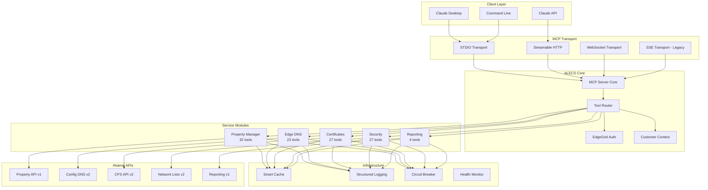

# ALECS Architecture Overview

**Version:** 1.7.4  
**Last Updated:** 2025-07-12

## System Design

ALECS implements the Model Context Protocol (MCP) to provide AI assistants with structured access to Akamai's CDN platform. The architecture emphasizes modularity, type safety, and clear separation of concerns.

## Core Architecture



## Component Architecture

### 1. MCP Server Core
- Handles protocol implementation (MCP 2025-06-18)
- Manages tool registration  
- Routes requests to handlers
- Provides transport abstraction (stdio, HTTP, WebSocket, SSE)
- Auto-detects optimal transport based on deployment

### 2. Service Modules (159 tools)
- **alecs-property** - CDN property configuration and management
- **alecs-dns** - DNS zones, records, and DNSSEC management
- **alecs-security** - Network lists, WAF, and security policies
- **alecs-certs** - SSL/TLS certificate lifecycle management
- **alecs-reporting** - Traffic analytics and performance metrics

### 3. Infrastructure Components

#### Smart Caching
- Intelligent TTL management
- Request deduplication
- Memory-efficient storage
- Cache invalidation strategies

#### Circuit Breaker
- Prevents cascade failures
- Automatic recovery
- Health monitoring
- Fallback responses

#### ID Translation & Hostname Routing
- **ID Translation Service**: Converts cryptic Akamai IDs to human-readable names
  - Property IDs (prp_123) → "My Website (prp_123)"
  - Group IDs, Contract IDs, CP Codes, Edge Hostnames
  - Comprehensive caching with LRU eviction
  - Batch translation support

- **Hostname Router**: Maps hostnames to Akamai resource context
  - Hostname → Property/CP Code relationships
  - Cross-service routing for DNS, AppSec, Reporting
  - Performance-optimized relationship caching
  - Enables hostname-centric workflows

#### Structured Logging
- Pino for high performance
- Contextual information
- Error tracking
- Performance metrics

### 4. Type System Architecture

```typescript
// Strong typing throughout
interface ToolDefinition<TParams = unknown, TResult = unknown> {
  name: string;
  description: string;
  inputSchema: JSONSchema;
  handler: (params: TParams) => Promise<ToolResult<TResult>>;
}

// Runtime validation
const propertySchema = z.object({
  propertyId: z.string().regex(/^prp_\d+$/),
  propertyName: z.string().min(1),
  contractId: z.string().regex(/^ctr_/),
  groupId: z.string().regex(/^grp_/)
});

// Type guards for safety
function isProperty(obj: unknown): obj is Property {
  return propertySchema.safeParse(obj).success;
}
```

## Design Principles

### 1. **Modularity**
Each service module is independent with clear interfaces

### 2. **Type Safety** 
100% TypeScript coverage with runtime validation

### 3. **User Experience**
Clear error messages with actionable solutions

### 4. **Performance**
Sub-second response times with intelligent caching

### 5. **Security**
EdgeGrid authentication with secure credential management

## Deployment Architecture

### Local Development (Claude Desktop/Cursor)
```
┌─────────────┐     ┌──────────────┐     ┌─────────────┐
│   Claude    │────▶│ ALECS Server │────▶│   Akamai    │
│   Desktop   │◀────│   (Local)    │◀────│    APIs     │
└─────────────┘     └──────────────┘     └─────────────┘
       stdio              HTTPS               HTTPS
```

### CDN Deployment (Streamable HTTP)
```
┌─────────────┐     ┌──────────────┐     ┌──────────────┐     ┌─────────────┐
│   Browser   │────▶│     CDN      │────▶│ ALECS Server │────▶│   Akamai    │
│   Client    │◀────│  Edge Node   │◀────│   (Origin)   │◀────│    APIs     │
└─────────────┘     └──────────────┘     └──────────────┘     └─────────────┘
   HTTP POST/SSE         HTTP/2              HTTPS               HTTPS
```

### WebSocket Deployment
```
┌─────────────┐     ┌──────────────┐     ┌─────────────┐
│  Real-time  │────▶│ ALECS Server │────▶│   Akamai    │
│   Client    │◀────│  (WebSocket) │◀────│    APIs     │
└─────────────┘     └──────────────┘     └─────────────┘
       WSS                HTTPS               HTTPS
```

### Multi-Customer Architecture
```
┌─────────────┐
│  .edgerc    │
├─────────────┤
│ [default]   │──┐
│ [customer1] │──┼──▶ Customer Context Manager
│ [customer2] │──┤         │
└─────────────┘  │         ▼
                 │    EdgeGrid Auth
                 │         │
                 └────────▶├─ Account Switch
                          └─ Request Signing
```

## Transport Architecture

### Transport Selection Strategy
The server automatically selects the optimal transport based on:
1. **Environment Variable**: `MCP_TRANSPORT` (highest priority)
2. **Deployment Context**: Auto-detection based on environment
3. **Default**: stdio for maximum compatibility

### Transport Characteristics

| Transport | Use Case | Protocol | Stateful | CDN-Friendly | Browser Support |
|-----------|----------|----------|----------|--------------|-----------------|
| **stdio** | CLI tools, Claude Desktop | stdin/stdout | Yes | No | No |
| **streamable-http** | Web apps, CDN deployment | HTTP POST + SSE | No | Yes | Yes |
| **websocket** | Real-time apps | WebSocket | Yes | Limited | Yes |
| **sse** | Legacy compatibility | HTTP + SSE | Partial | Yes | Yes |

### Transport Configuration

#### Streamable HTTP (Recommended for Web)
```bash
# Environment variables
MCP_TRANSPORT=streamable-http
HTTP_PORT=8080              # Server port
HTTP_HOST=0.0.0.0          # Bind address
HTTP_PATH=/mcp             # URL path prefix
CORS_ENABLED=true          # Enable CORS
AUTH_TYPE=token            # Authentication type
```

#### WebSocket
```bash
MCP_TRANSPORT=websocket
WS_PORT=8080               # WebSocket port
WS_HOST=0.0.0.0          # Bind address
WS_PATH=/mcp              # WebSocket path
```

## Performance Characteristics

- **Startup Time**: <2 seconds
- **Tool Response**: <500ms (cached), <3s (API call)
- **Memory Usage**: ~150MB baseline
- **Concurrent Requests**: Up to 50
- **Cache Hit Rate**: >80% in typical usage

## Future Architecture Evolution

1. **Plugin System** - Dynamic tool loading
2. **Distributed Cache** - Redis for shared state
3. **Event Streaming** - Real-time updates
4. **GraphQL Layer** - Unified query interface
5. **Observability** - OpenTelemetry integration