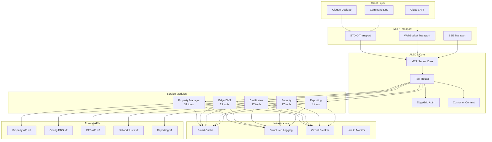

# ALECS Architecture Overview

**Version:** 1.7.4  
**Last Updated:** 2025-07-07

## System Design

ALECS implements the Model Context Protocol (MCP) to provide AI assistants with structured access to Akamai's CDN platform. The architecture emphasizes modularity, type safety, and clear separation of concerns.

## Core Architecture



## Component Architecture

### 1. MCP Server Core
- Handles protocol implementation
- Manages tool registration
- Routes requests to handlers
- Provides transport abstraction

### 2. Service Modules (113 tools)
- **alecs-property** - CDN property configuration and management
- **alecs-dns** - DNS zones, records, and DNSSEC management
- **alecs-security** - Network lists, WAF, and security policies
- **alecs-certs** - SSL/TLS certificate lifecycle management
- **alecs-reporting** - Traffic analytics and performance metrics

### 3. Infrastructure Components

#### Smart Caching
- Intelligent TTL management
- Request deduplication
- Memory-efficient storage
- Cache invalidation strategies

#### Circuit Breaker
- Prevents cascade failures
- Automatic recovery
- Health monitoring
- Fallback responses

#### Structured Logging
- Pino for high performance
- Contextual information
- Error tracking
- Performance metrics

### 4. Type System Architecture

```typescript
// Strong typing throughout
interface ToolDefinition<TParams = unknown, TResult = unknown> {
  name: string;
  description: string;
  inputSchema: JSONSchema;
  handler: (params: TParams) => Promise<ToolResult<TResult>>;
}

// Runtime validation
const propertySchema = z.object({
  propertyId: z.string().regex(/^prp_\d+$/),
  propertyName: z.string().min(1),
  contractId: z.string().regex(/^ctr_/),
  groupId: z.string().regex(/^grp_/)
});

// Type guards for safety
function isProperty(obj: unknown): obj is Property {
  return propertySchema.safeParse(obj).success;
}
```

## Design Principles

### 1. **Modularity**
Each service module is independent with clear interfaces

### 2. **Type Safety** 
100% TypeScript coverage with runtime validation

### 3. **User Experience**
Clear error messages with actionable solutions

### 4. **Performance**
Sub-second response times with intelligent caching

### 5. **Security**
EdgeGrid authentication with secure credential management

## Deployment Architecture

### Production Setup
```
┌─────────────┐     ┌──────────────┐     ┌─────────────┐
│   Claude    │────▶│ ALECS Server │────▶│   Akamai    │
│   Desktop   │◀────│   (Local)    │◀────│    APIs     │
└─────────────┘     └──────────────┘     └─────────────┘
       stdio              HTTPS               HTTPS
```

### Multi-Customer Architecture
```
┌─────────────┐
│  .edgerc    │
├─────────────┤
│ [default]   │──┐
│ [customer1] │──┼──▶ Customer Context Manager
│ [customer2] │──┤         │
└─────────────┘  │         ▼
                 │    EdgeGrid Auth
                 │         │
                 └────────▶├─ Account Switch
                          └─ Request Signing
```

## Performance Characteristics

- **Startup Time**: <2 seconds
- **Tool Response**: <500ms (cached), <3s (API call)
- **Memory Usage**: ~150MB baseline
- **Concurrent Requests**: Up to 50
- **Cache Hit Rate**: >80% in typical usage

## Future Architecture Evolution

1. **Plugin System** - Dynamic tool loading
2. **Distributed Cache** - Redis for shared state
3. **Event Streaming** - Real-time updates
4. **GraphQL Layer** - Unified query interface
5. **Observability** - OpenTelemetry integration