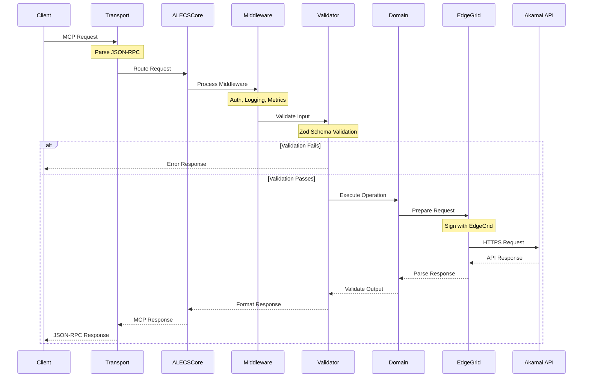
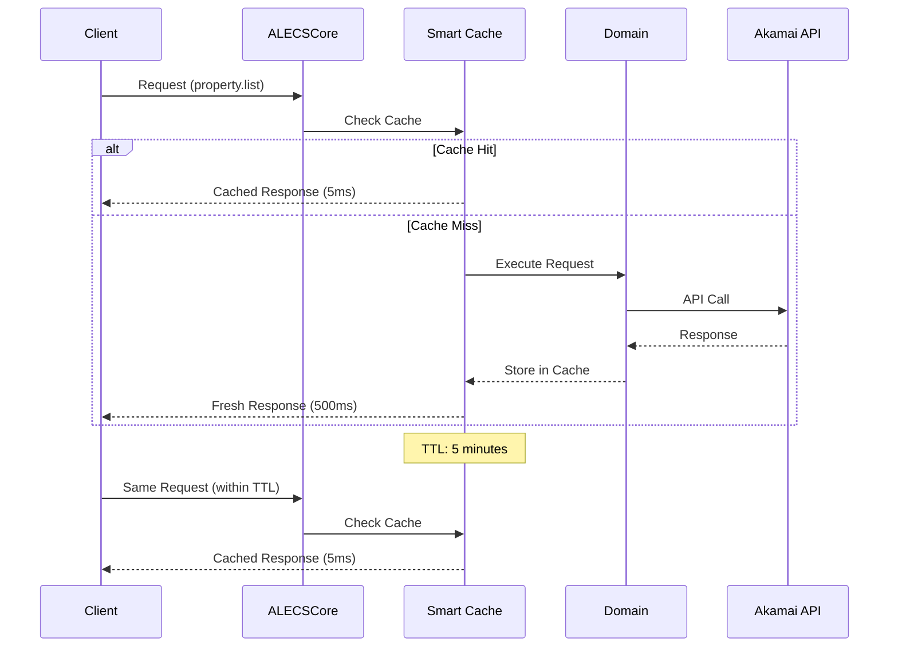
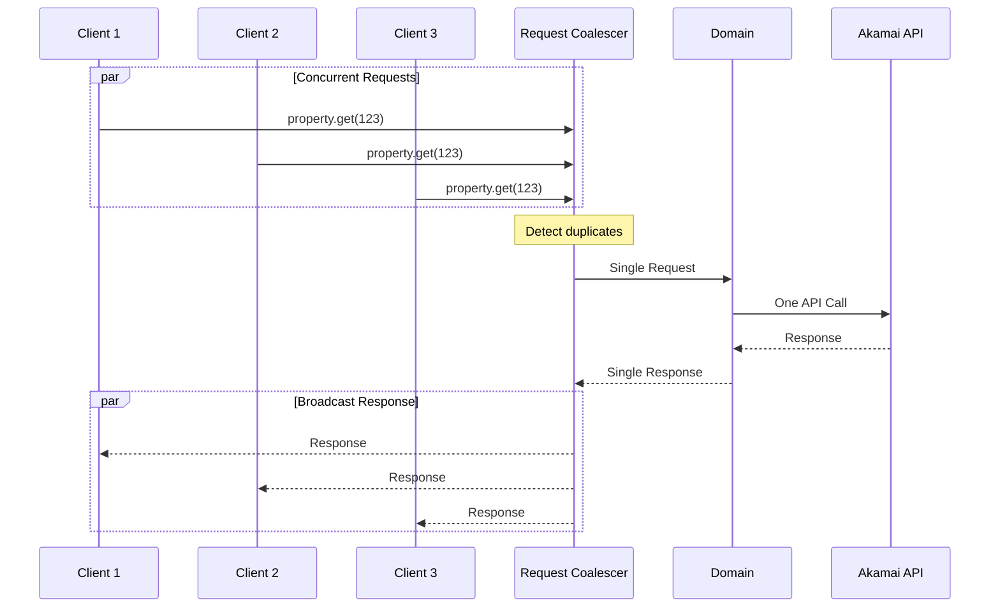
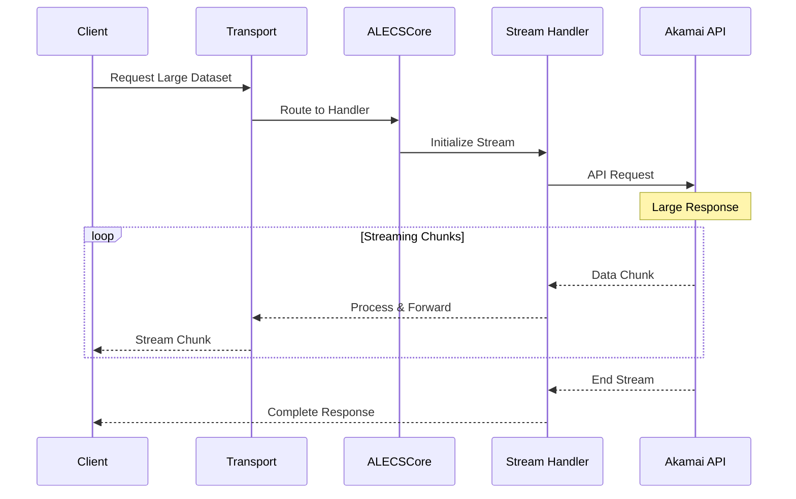
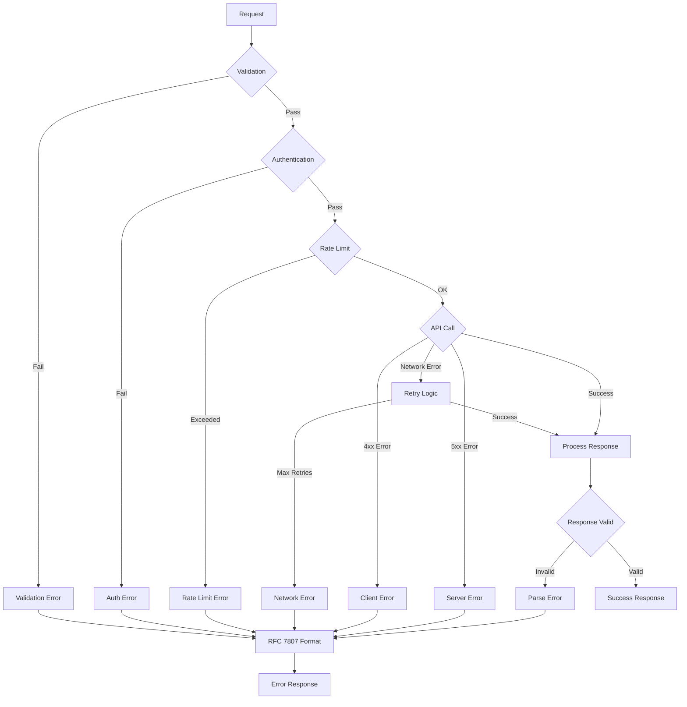
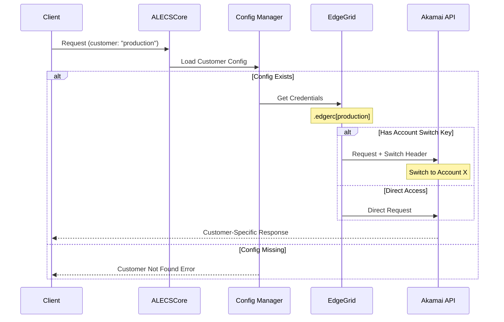
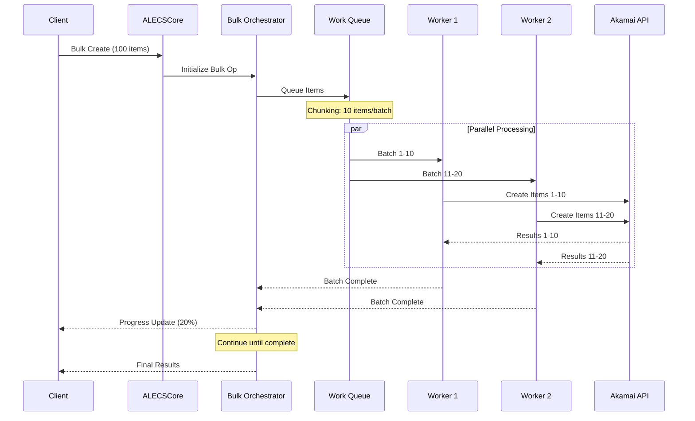
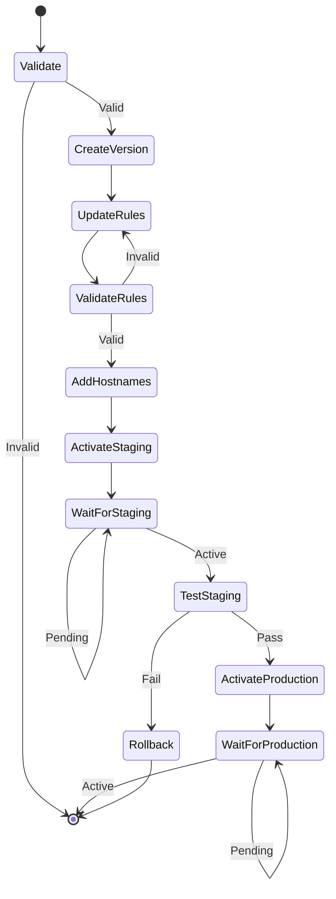

# ALECS Request Flow Documentation

## Overview

This document details the various request flows through the ALECS MCP Server, from client request to Akamai API response. Understanding these flows is crucial for debugging, performance optimization, and system maintenance.

## Table of Contents

1. [Standard Request Flow](#standard-request-flow)
2. [Cached Request Flow](#cached-request-flow)
3. [Coalesced Request Flow](#coalesced-request-flow)
4. [Streaming Request Flow](#streaming-request-flow)
5. [Error Handling Flow](#error-handling-flow)
6. [Multi-Customer Request Flow](#multi-customer-request-flow)
7. [Bulk Operation Flow](#bulk-operation-flow)
8. [Activation Workflow](#activation-workflow)

## Standard Request Flow

The standard flow represents a typical request without caching or coalescing.



### Detailed Steps

1. **Client Request**: Client sends MCP request via chosen transport
2. **Transport Parsing**: Transport layer parses JSON-RPC format
3. **Request Routing**: ALECSCore identifies target tool and handler
4. **Middleware Pipeline**: 
   - Authentication check
   - Request logging
   - Metrics collection
   - Rate limiting
5. **Input Validation**: Zod schemas validate all parameters
6. **Domain Execution**: Business logic processes request
7. **API Preparation**: EdgeGrid authentication signs request
8. **Akamai API Call**: HTTPS request to Akamai endpoint
9. **Response Processing**: Parse and validate API response
10. **Response Formatting**: Convert to MCP format
11. **Client Response**: Return formatted result

## Cached Request Flow

Demonstrates how the Smart Cache intercepts repeated requests.



### Cache Key Generation

```typescript
function generateCacheKey(request: MCPRequest): string {
    return crypto.createHash('sha256')
        .update(JSON.stringify({
            method: request.method,
            params: request.params,
            customer: request.context.customer,
            account: request.context.accountSwitchKey
        }))
        .digest('hex');
}
```

### Cache Invalidation Triggers

- CREATE operations invalidate LIST caches
- UPDATE operations invalidate GET and LIST caches
- DELETE operations invalidate all related caches
- Manual invalidation via cache.invalidate(pattern)
- TTL expiration (default: 5 minutes)

## Coalesced Request Flow

Shows how identical concurrent requests are deduplicated.



### Coalescing Window

- Default: 100ms window for request aggregation
- Configurable per operation type
- Automatic retry for failed coalesced requests

## Streaming Request Flow

For large responses that benefit from streaming.



### Streaming Benefits

- 80% memory reduction for large responses
- Progressive rendering in client
- Timeout prevention for long operations
- Backpressure handling

## Error Handling Flow

Comprehensive error handling with recovery strategies.



### Error Response Format (RFC 7807)

```json
{
    "type": "https://errors.akamai.com/property/not-found",
    "title": "Property Not Found",
    "status": 404,
    "detail": "Property 'prp_123456' not found in contract 'ctr_C-1234'",
    "instance": "/property/get/prp_123456",
    "propertyId": "prp_123456",
    "contractId": "ctr_C-1234",
    "suggestion": "Verify the property ID or check contract access"
}
```

## Multi-Customer Request Flow

Demonstrates account switching and customer isolation.



### Customer Configuration

```typescript
interface CustomerConfig {
    name: string;
    edgercSection: string;
    accountSwitchKey?: string;
    rateLimit?: {
        requests: number;
        window: number;
    };
    cache?: {
        ttl: number;
        maxSize: number;
    };
}
```

## Bulk Operation Flow

Efficient handling of bulk operations with progress tracking.



### Bulk Operation Optimizations

- Parallel processing with configurable concurrency
- Automatic retry for failed items
- Progress reporting via callbacks
- Partial success handling
- Memory-efficient streaming for results

## Activation Workflow

Complex multi-step workflow for property activation.



### Activation Status Polling

```typescript
async function pollActivationStatus(
    activationId: string,
    network: 'STAGING' | 'PRODUCTION'
): Promise<ActivationStatus> {
    const maxAttempts = 60; // 30 minutes
    const pollInterval = 30000; // 30 seconds
    
    for (let i = 0; i < maxAttempts; i++) {
        const status = await checkActivation(activationId, network);
        
        if (status === 'ACTIVE') {
            return status;
        }
        
        if (status === 'FAILED' || status === 'ABORTED') {
            throw new ActivationError(status);
        }
        
        await sleep(pollInterval);
    }
    
    throw new TimeoutError('Activation timeout');
}
```

## Performance Metrics

### Request Flow Performance

| Flow Type | Average Response Time | P95 Response Time | API Calls Saved |
|-----------|----------------------|-------------------|-----------------|
| Cached | 5ms | 10ms | 100% |
| Coalesced | 500ms | 800ms | 66-75% |
| Standard | 500ms | 1200ms | 0% |
| Streaming | 100ms (first byte) | 200ms | 0% |
| Bulk (100) | 5000ms | 8000ms | 90% |

### Optimization Impact

1. **Cache Hit Ratio**: 85-90% for read operations
2. **Coalescing Rate**: 30-40% reduction in API calls
3. **Streaming Memory**: 80% reduction for large datasets
4. **Bulk Efficiency**: 10x faster than individual operations

## Monitoring and Observability

### Request Tracing

Each request is assigned a unique trace ID:

```typescript
interface RequestTrace {
    traceId: string;
    spanId: string;
    parentSpanId?: string;
    startTime: number;
    endTime?: number;
    attributes: {
        'mcp.tool': string;
        'mcp.customer': string;
        'akamai.endpoint': string;
        'cache.hit': boolean;
        'coalesce.hit': boolean;
    };
}
```

### Metrics Collection

- Request count by tool
- Response time histograms
- Cache hit/miss ratios
- API error rates
- Coalescing effectiveness

## Best Practices

### For Optimal Performance

1. **Use Batch Operations**: Prefer bulk endpoints over loops
2. **Leverage Caching**: Design cache-friendly request patterns
3. **Enable Streaming**: For large dataset operations
4. **Coalesce Requests**: Group similar operations together

### For Reliability

1. **Handle Partial Failures**: Bulk operations may partially succeed
2. **Implement Retries**: Use exponential backoff
3. **Monitor Rate Limits**: Stay within customer quotas
4. **Validate Early**: Catch errors before API calls

### For Debugging

1. **Use Trace IDs**: Correlate logs across services
2. **Check Cache Headers**: Verify cache behavior
3. **Monitor Coalescing**: Ensure proper deduplication
4. **Review Error Details**: RFC 7807 provides rich context

## Conclusion

Understanding these request flows is essential for:
- Debugging performance issues
- Optimizing API usage
- Implementing new features
- Troubleshooting customer problems

The ALECS architecture's sophisticated request handling enables enterprise-scale operations while maintaining excellent performance and reliability.