# ALECS Visual Architecture Guide

## System Overview

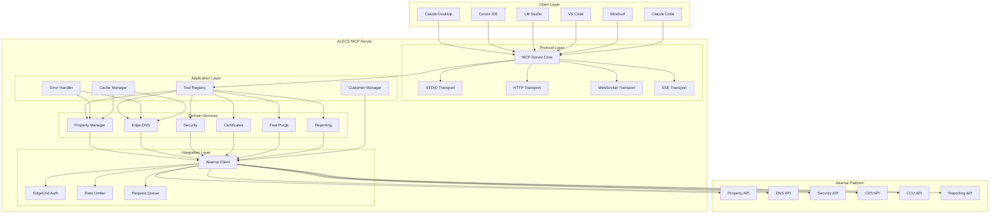

## Request Processing Flow

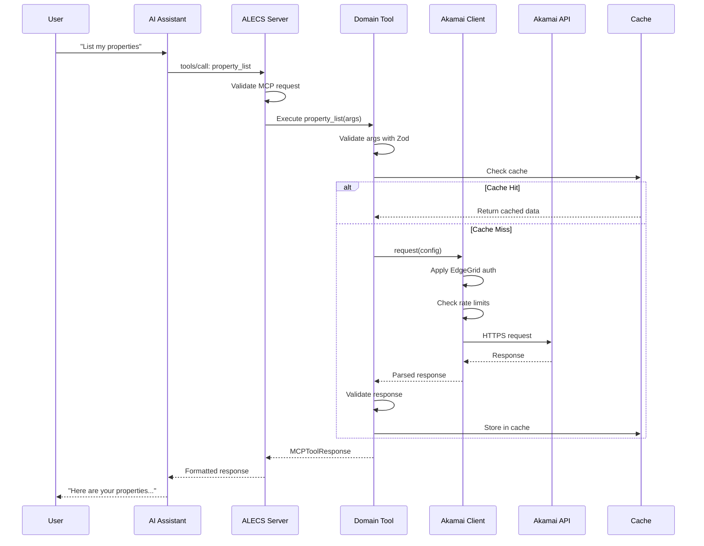

## Multi-Customer Architecture

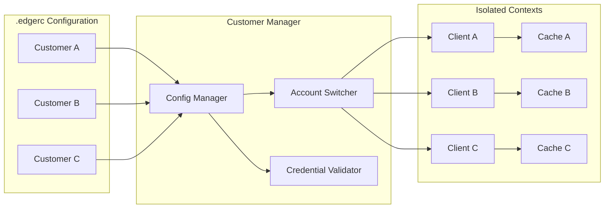

## Tool Registration & Discovery

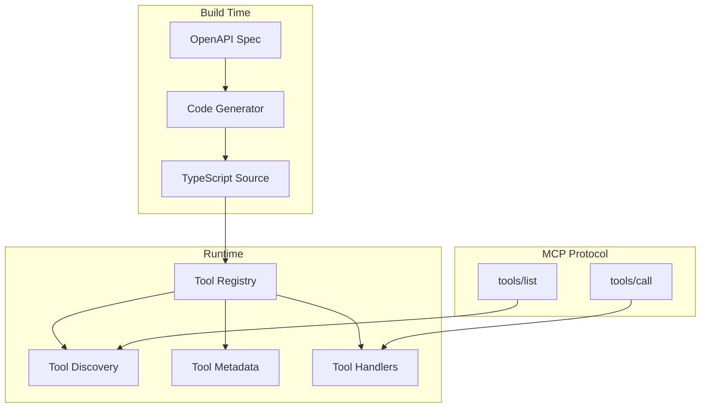

## Error Handling Flow

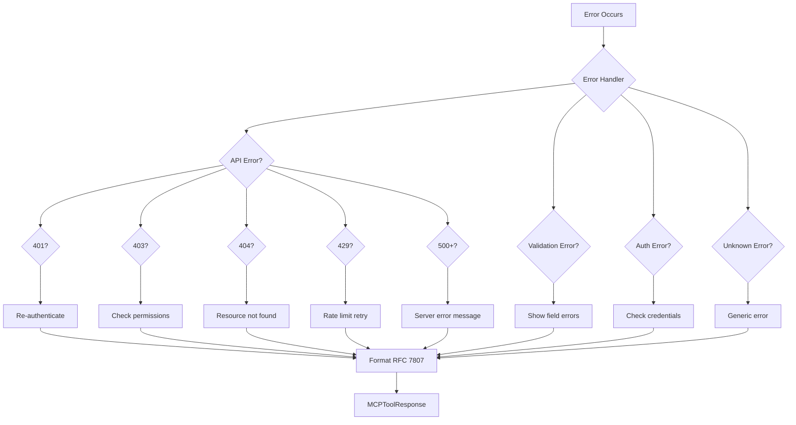

## Caching Strategy

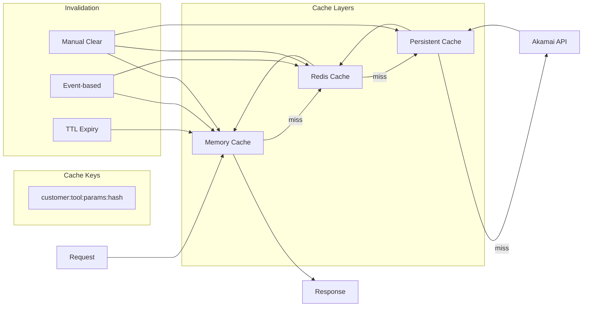

## Security Architecture

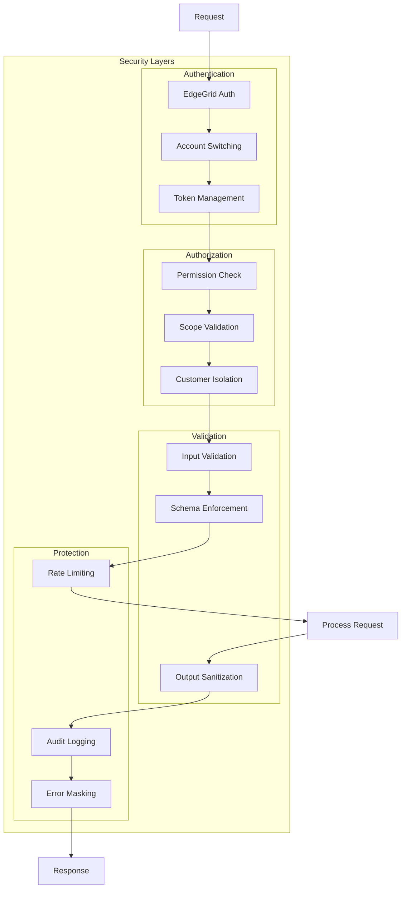

## Deployment Architecture

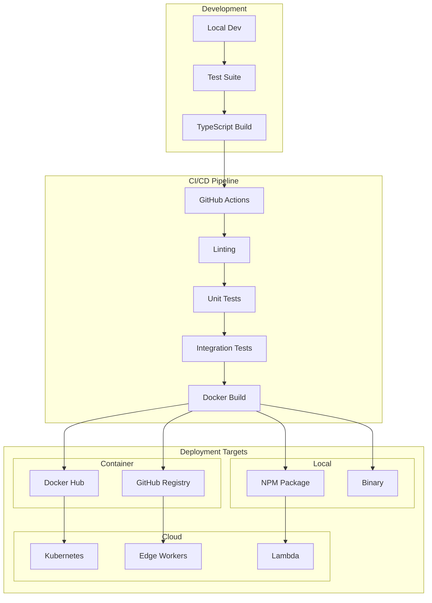

## Performance Optimization

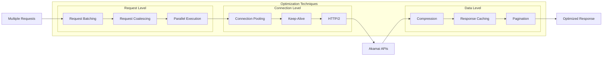

## Tool Development Lifecycle

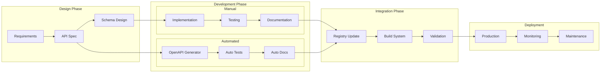

## Component Interaction Matrix

| Component | MCP Server | Tool Registry | Domain Tools | Akamai Client | Cache | Error Handler |
|-----------|------------|---------------|--------------|---------------|-------|---------------|
| **MCP Server** | - | Loads tools | - | - | - | - |
| **Tool Registry** | Registers | - | Instantiates | - | - | - |
| **Domain Tools** | - | Registered in | - | Uses | Uses | Uses |
| **Akamai Client** | - | - | Used by | - | - | - |
| **Cache** | - | - | Used by | - | - | - |
| **Error Handler** | - | - | Used by | - | - | - |

## Technology Stack

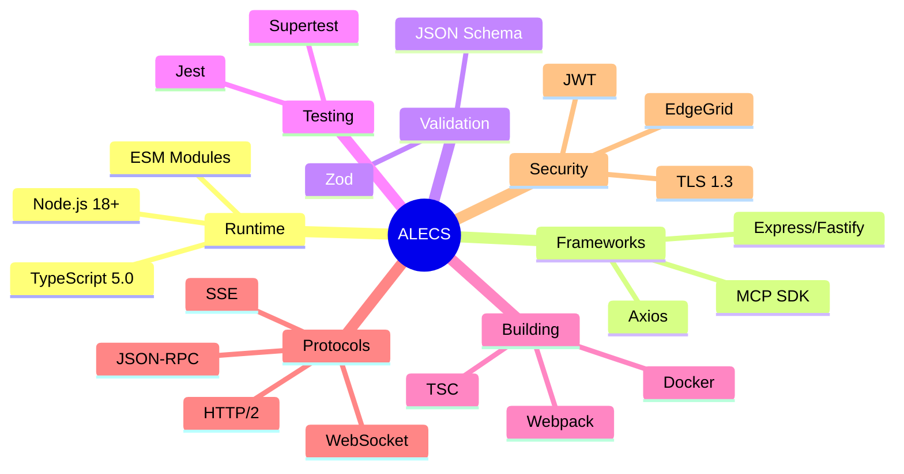

This visual architecture guide provides comprehensive diagrams showing:

1. **System Overview** - How all components connect
2. **Request Flow** - Step-by-step request processing
3. **Multi-Customer** - Tenant isolation architecture
4. **Tool Discovery** - Registration and runtime discovery
5. **Error Handling** - Complete error flow with RFC 7807
6. **Caching** - Multi-layer cache strategy
7. **Security** - Defense in depth approach
8. **Deployment** - CI/CD and deployment options
9. **Performance** - Optimization techniques
10. **Development** - Tool creation lifecycle

Each diagram can be rendered using Mermaid in any Markdown viewer that supports it.