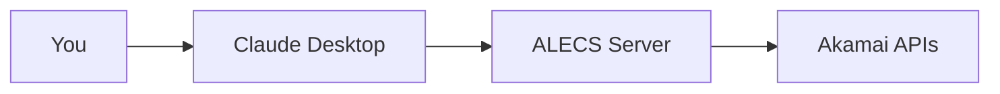
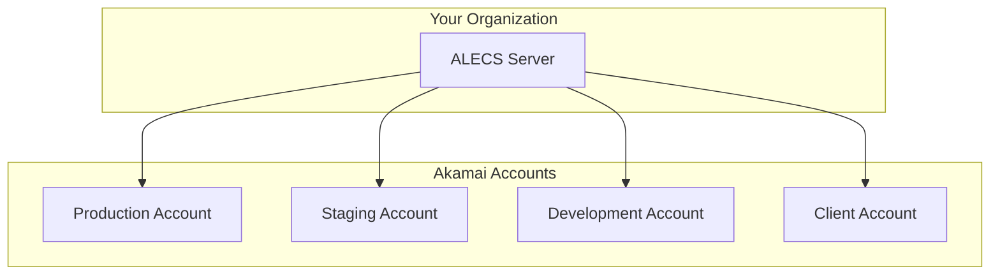
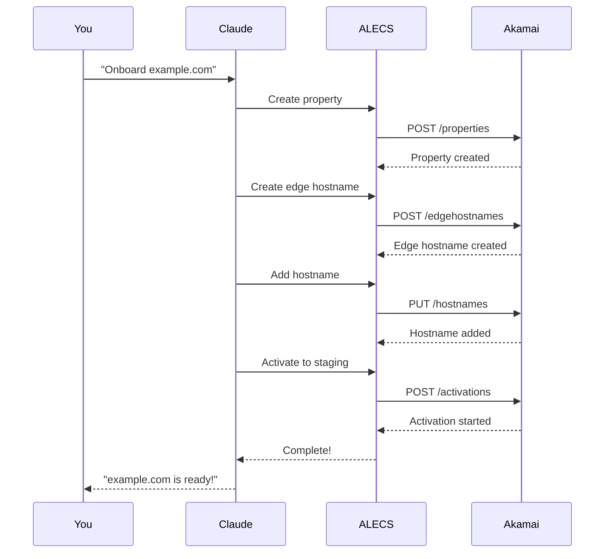

# Getting Started with ALECS

This guide will help you get ALECS up and running in minutes.

## Prerequisites

- **Node.js 18+** - [Download](https://nodejs.org/)
- **Akamai Account** - With API credentials
- **Claude Desktop** - [Download](https://claude.ai/download) (optional)

## Quick Setup

### 1. Install ALECS

```bash
# Clone the repository
git clone https://github.com/your-org/alecs-mcp-server-akamai.git
cd alecs-mcp-server-akamai

# Run the installer
./install.sh
```

### 2. Configure Akamai Credentials

ALECS uses the standard Akamai `.edgerc` file for authentication.

```bash
# Copy the example file
cp .edgerc.example ~/.edgerc

# Edit with your credentials
nano ~/.edgerc
```

Your `.edgerc` should look like:

```ini
[default]
client_secret = your-client-secret-here
host = your-host.luna.akamaiapis.net
access_token = your-access-token-here
client_token = your-client-token-here

; Optional: Multiple customers
[customer-acme]
client_secret = acme-client-secret
host = acme.luna.akamaiapis.net
access_token = acme-access-token
client_token = acme-client-token
account_switch_key = ACME_ACCOUNT_KEY
```

### 3. Choose Your Setup

The installer will ask how you want to run ALECS:

```
How would you like to run ALECS?
1) Direct Node.js (recommended for development)
2) Docker (recommended for production)
3) PM2 (for background service)
4) Claude Desktop integration
```

## Integration Options

### Option A: Claude Desktop (Recommended)

Perfect for interactive CDN management through Claude's UI.



**Setup Steps:**

1. Choose option 4 in the installer
2. Copy the generated config:
   ```bash
   cp claude_desktop_config.json ~/Library/Application\ Support/Claude/
   ```
3. Restart Claude Desktop
4. Start chatting: "List my Akamai properties"

### Option B: Development Mode

Best for testing and development.

```bash
# Start the server
./start.sh

# Choose mode:
# 1) Standard MCP server (stdio)
# 2) WebSocket server
# 3) SSE server
```

### Option C: Docker

Ideal for production deployments.

```bash
# Using docker-compose
docker-compose up -d

# View logs
docker-compose logs -f
```

## Your First Commands

Once ALECS is running with Claude Desktop, try these commands:

### 1. List Your Properties
```
"Show me all my Akamai properties"
```

### 2. Create a Property
```
"Create a new property called 'my-website' for web delivery"
```

### 3. Manage DNS
```
"List my DNS zones"
"Add an A record for www.example.com pointing to 1.2.3.4"
```

### 4. Deploy Changes
```
"Activate my-website property to staging"
```

## Multi-Customer Setup

ALECS supports managing multiple Akamai accounts:



**Usage:**
```
"List properties for customer acme"
"Create DNS zone example.com for customer staging"
```

## Common Workflows

### 1. Property Onboarding



### 2. Content Purging

```
"Purge the homepage from cache"
"Invalidate all images under /assets/"
"Clear cache for CP code 12345"
```

### 3. Security Updates

```
"Create a network list for US IP addresses"
"Block these IPs: 1.2.3.4, 5.6.7.8"
"Add China to the geo-blocking list"
```

## Troubleshooting

### Authentication Issues

```bash
# Test your credentials
curl -X GET https://your-host.luna.akamaiapis.net/papi/v1/contracts \
  --header "Authorization: ..."
```

### Connection Problems

```bash
# Check ALECS is running
ps aux | grep alecs

# View logs
tail -f ~/.alecs/logs/alecs.log
```

### Common Errors

| Error | Solution |
|-------|----------|
| "Invalid credentials" | Check your `.edgerc` file |
| "Property not found" | Verify property ID and customer |
| "Permission denied" | Check API client permissions |
| "Rate limited" | Wait and retry, or contact Akamai |

## Next Steps

- 📖 Read the [Architecture Overview](../architecture/README.md)
- 🛠️ Explore [Available Tools](../api/README.md)
- 📚 Check out [User Guides](../user-guides/README.md)
- 🧪 Learn about [Testing](../development/testing-strategy.md)

## Getting Help

- **GitHub Issues**: [Report bugs or request features](https://github.com/your-org/alecs-mcp-server-akamai/issues)
- **Discussions**: [Ask questions](https://github.com/your-org/alecs-mcp-server-akamai/discussions)
- **Akamai Docs**: [Official API documentation](https://techdocs.akamai.com)

---

Ready to manage your CDN with AI? Let's go! 🚀